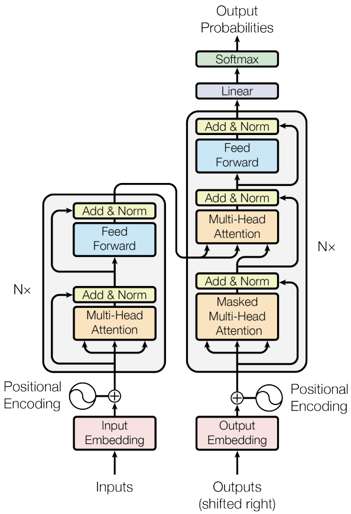
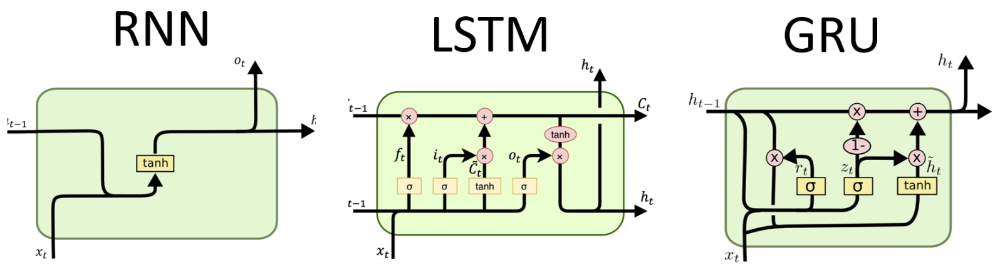
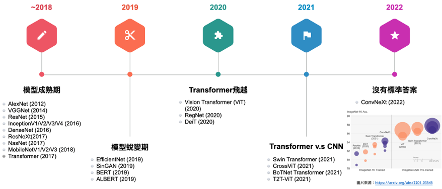

# [Day10] Transformer，就決定是你了

Author: Nick Zhuang
Type: AI & Data

## 提要

- [前言](#前言)
- [什麼是Transformer](#什麼是transformer)
- [Transformer的由來](#transformer的由來)
- [近年來DL模型的演進](#近年來dl模型的演進)

## 前言

今天我們介紹 Transformer 相關的內容，包含：什麼是Transformer、Transformer的由來、及近年來Transformer的演進。

## 什麼是Transformer

Transformer是一個 seq2seq 的模型，他其中最主要的關鍵是 Attention 的架構，至於是如何做到這點的？它利用了自編碼器 ( Auto Encoder )的架構作為基底延伸，將編碼器 (Encoder) 的輸入全部灌到解碼器 ( Decoder )，讓 Decoder 透過 Attention 去決定要學習的特徵，架構圖如下所示。

## Transformer的由來

早期的 seq2seq 模型是應用在自然語言領域 ( Natural Language Processing, NLP )，其中最著名的就是循環神經網路 ( Recurrent Neural Network, RNN )，但它存在著記憶的問題，因其架構上會紀錄兩兩詞彙之間的關係，但這樣的關係會隨著語句的加長遞減，導致越長的語句，跨距離的詞彙關係變得微弱，網路難以學習到有效的特徵，為了解決這樣的問題，後面有人提出了記憶延長的架構，就是著名的長短期記憶 (Long Short Term Memory, LSTM) 及門控循環單元 (Gate Recurrent Unit, GRU) 的架構，LSTM 主要的好處是有遺忘門的機制，這樣可以學習更長語句間的相同詞彙的關係，GRU 則是 LSTM 的變體，更節省運算資源，因其將遺忘門與更新門合併處理，不過這些架構依舊存在 tokenize 的限制，因此，受惠於 Attention 的啟發，seq2seq 模型可以學習到全局特徵，這就是 Transformer。

## 近年來DL模型的演進

在 Transformer 橫空出世後，在圖像處理相關的領域也逐漸有了新的啟發，其中開第一槍的就是著名的 ViT ( Vision Transformer )，這是第一個用到 Transformer 的圖像領域的成功研究，承接此研究就是後面著名的 Swin Transformer，它用到了 Slide Window 的機制去減少運算量，從這開始逐漸有人在探討究竟在圖像分類領域的問題處理上，究竟是卷積神經網路 (Convolution Neural Network, CNN) 還是 Transformer 比較好，因此在2020的論文 ConvNext 中有做了詳盡的討論，作者將其 ResNext 做了修改，將其往 Transformer 架構靠攏，比較了 Swin Transformer，略優於 Swin Transformer，這故事告訴我們沒有最優的架構存在，其中的關鍵在於數據的處理、及當下情境的最適配考量，沒有標準答案。

## 小結

今天我們介紹了 Transformer 相關的內容；例如，什麼是Transformer、Transformer的由來、及近年來Transformer的演進，明天我們會介紹 Nerf 的內容，明天見！

## 參考連結

- [Attention Is All You Need](https://arxiv.org/pdf/1706.03762.pdf)
- [RNN, LSTM & GRU](http://dprogrammer.org/rnn-lstm-gru)
- [Transformer-李宏毅老師](https://hackmd.io/@abliu/BkXmzDBmr)
