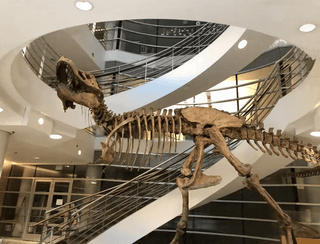

# [Day11] NeRF，聽說你是建模達人

Author: Nick Zhuang
Type: AI & Data

## 提要

- [前言](#前言)
- [什麼是NeRF](#什麼是nerf)
- [NeRF的演算法](#nerf的演算法)
- [NeRF的特色](#nerf的特色)

## 前言

今天我們會探討關於 NeRF 的內容，這是一種學習建模方法的模型，包含：什麼是NeRF、及NeRF的演算法。

[NeRF官網傳送門](https://www.matthewtancik.com/nerf "click to watch demo")

## 什麼是NeRF

神經輻射場 (Neural Radiance Field, NeRF)，是一種會學習場景表示的模型，它會將場景表示為視圖合成的神經輻射場，早期的研究來自Siren，這是一種以複雜函數去模擬場景建模的方法，相較於ReLU要更好，如下圖所示。

NeRF 的方法就是從 Siren 演進來的，這個神經網路訓練的本質與我們以往所認知的有著極大的差異。這邊大家可以思考一個問題，什麼是AI？基本上，攏統的說法可以是，AI是以資料為驅動的演算法，就是所謂的Data driven，這與早期的專家系統的Rule driven有很大的不同，NeRF 的做法是他先以一個複雜函數模擬對應的一個場景表示，然後去最小化損失函數，最後模型所學習到的權重，就會是那個場景的表示，在訓練的過程中，會以雷射線做為向量延伸到場景邊界，其中的每個點作為視點 ( view point )，因不同的視點會有不同的視角，最終學習到的結果就會是，同個場景內不同視點的不同視角下的觀測表示，參考下圖。

下圖源自於官網的例子，單一視點在恐龍骨架下的場景建模表示。

## NeRF的演算法

這節我們要細部拆解其中用到的演算法邏輯；例如，核心概念、形體繪製、位置編碼、及階層取樣。

- ### 核心概念

這邊整理了整個 NeRF 的核心概念，從不同的 view point 做 ray tracing，將不同 view point 對應的資訊輸入進模型做訓練，最後 inference 的結果，就可以從單一場景內的任一 view point 觀看場景的內容，這邊是意圖裡面的是一棵聖誕樹(定義：綠色圓錐為聖誕樹)，從不同的 view point 去觀看，記錄其不同的視角，輸入到模型中訓練，模型最後會記得的是在任一 view point 的場景內容，就是在任一空間內的點上，在那個點可以看到哪些東西，這就是最後可以 inference 出來的結果。

- ### 形體繪製

模型訓練階段，這邊要講幾個訓練上的依據，(a)和(b)演示了關於定義向量場輸入到多層感知機 ( Multilayer Perceptron, MLP ) 模型的格式，先從單一雷射線的每個點出發，紀錄其 view point 及視角作為輸入，至於細節的解說，主要用到了形體繪製 (volume rendering) 的方法，可以看到(c)的示意圖，雷射線碰到要建模的場景裡面的顏色是會有變化的，所以如果指定某個顏色，像這他是選定咖啡色，當雷射線上的點到了接近咖啡色的時候，圖形的曲線就會上升，代表那邊周圍有很多接近咖啡色的色塊，至於下方小圖是指說可能會有重複的顏色，像有時候在場景內會有玻璃，當光線穿過玻璃進到內部及穿出玻璃到外部的兩個位置就會是波峰這樣，在(d)中展示了要學習最小化損失，才能讓模型學習的更好，以生成足夠逼真的場景。

- ### 位置編碼

位置編碼 ( position encoding ) 與階層取樣 ( hierarchical volume sampling )，這兩個都是在 NeRF 中優化其效果的方法，position encoding 的主要概念是要讓位置的表示式有更複雜的表示，進而強化點與點之間的變化幅度，從前段我們可以知道，雷射線的表示式是線性的，而每一個點與點間的變化是曲線表示，那要如何做到這點？可以看到是用sin(x), sin(2x), sin(4x)逐漸去壓縮正弦函數的表示，這樣的好處是讓沿線改變參考點的時候，讓點與點之間的變化幅度增大，這樣就可以有更豐富的表示，能夠掌握空間中細節的變化。

- ### 階層取樣

階層取樣 ( hierarchical volume sampling )，是在 NeRF 中優化其效果的方法，它的作法是設計一個密度函數，讓沿著雷射線的不同點有不同的密度，仔細想其實也蠻合理，像我們在空間中一定有存在一些地方就是空氣，那麼在空氣的沿線觀察，顏色就不會有太多的變化，雖然如此，但還是會存在些細節的變化是我們想要捕捉的，所以可以透過這個方式去擷取到更細節變化，讓建模出來的結果更逼真。

## NeRF的特色

由前一節所示，我們已經知道在這樣的設計底下，場景建模的表示可以非常精細，甚至是光影的效果也能呈現，因此，針對任一場景都可以有非常逼真的表示，在配備方面，因為是利用階層取樣的緣故，所以不需要使用到非常多張的顯示卡來做訓練，在實作上這樣的做法比較親民，不像有些大型語言模型必須要用到極大的算力來呈現，算是個優點，另外，訓練出來的模型也非常小(以論文的例子來看，5MB左右)，容量小的情況有助於inference的速度及實際場景的應用便利性，不過這樣的方法也不是沒有缺點，畢竟他是針對單一場景做建模，多重複雜場景的情況就存在其實際實現的困難度，雖然如此，這樣的做法給了我們新的啟發，原來模型不是只能吃一維或二維資料，是有方法可以讓模型去存建模的場景的，算是刷新了筆者的三觀吧，只能說關於 AI 的水位真的很深，要面面俱到真的非常不容易。

## 小結

今天我們探討了關於NeRF的內容；例如，什麼是NeRF、NeRF的演算法、及NeRF的特色，後續，我們會接續GAI中的演算法做詳細的探討，明天見！

## 參考連結

- [Implicit Neural Representations with Periodic Activation Functions](https://www.vincentsitzmann.com/siren/)
- [NeRF](https://www.matthewtancik.com/nerf)
- [NeRF: Representing Scenes as Neural Radiance Fields for View Synthesis](https://arxiv.org/pdf/2003.08934.pdf)
