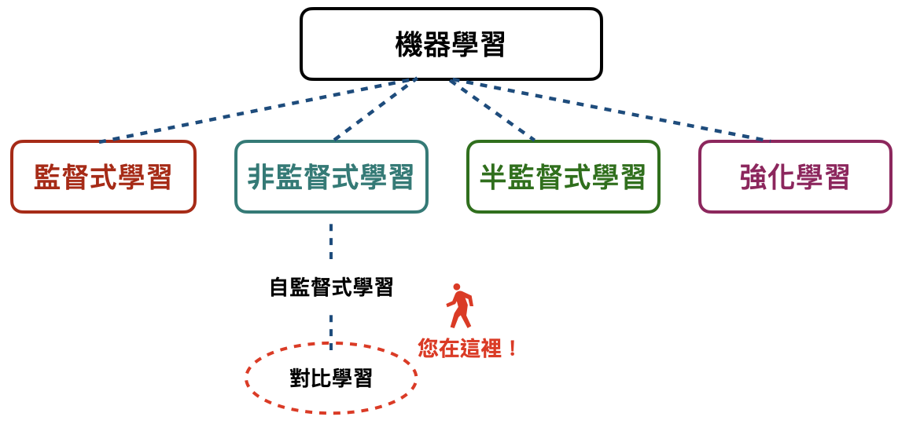
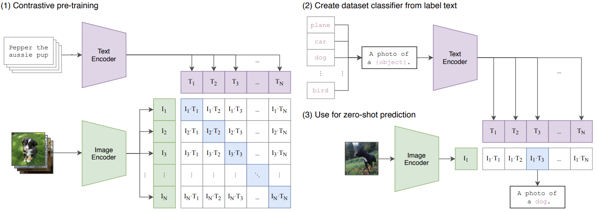
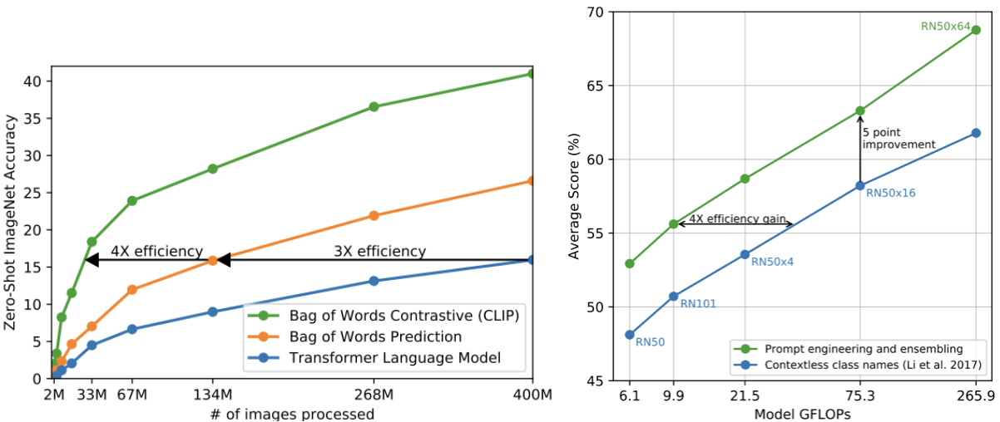
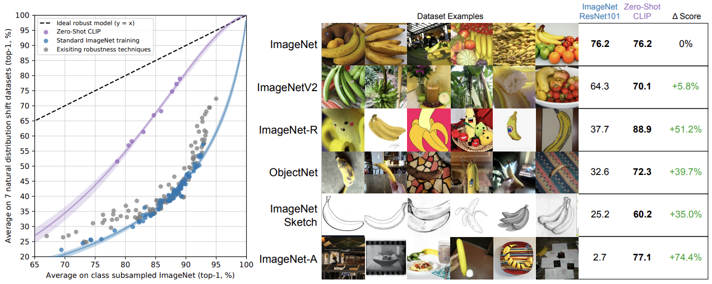
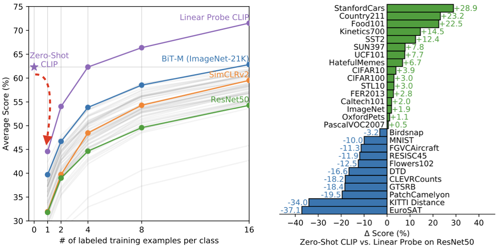
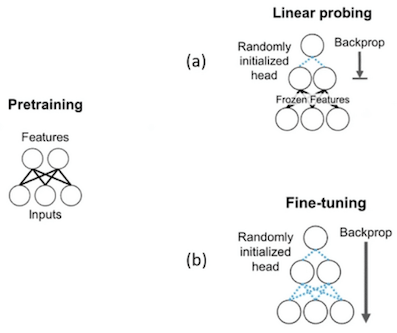
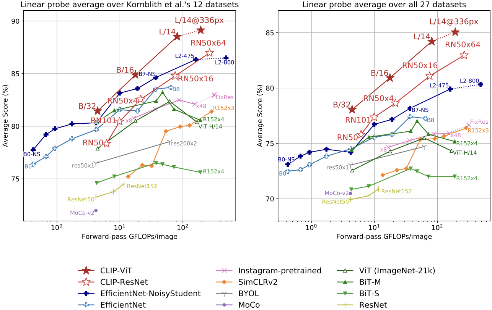
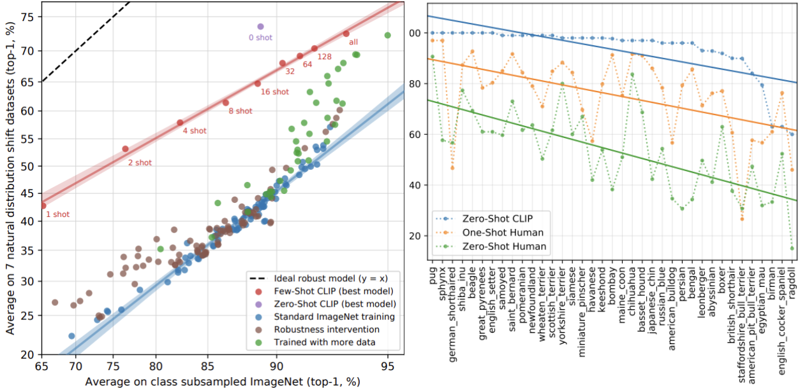

# [Day12] CLIP，文字圖像你都會？

Author: Nick Zhuang
Type: AI & Data

## 提要

- [前言](#前言)
- [什麼是CLIP](#什麼是clip)
- [CLIP的演算法](#clip演算法)
- [CLIP的特色](#clip的特色)

## 前言

今天我們介紹 CLIP 相關的內容，CLIP是一個影像的分類器，它的概念來自於前期的 conVIRT 優化，conVIRT 是一個關於醫療影像的對比式學習研究，本日內容包含：什麼是CLIP、CLIP的演算法、及CLIP的特色。

## 什麼是CLIP

基本上就是一個影像的分類器，只是它可以自動將其分類，並透過文字prompt方式呈現標記，另外，它也是 zero shot 的分類器，zero shot的概念最早來自於對比學習 ( contrastive learning )，這個方法是基於機器學習 ( machine learning, ML ) 底下的非監督式學習 ( unsupervised learning ) 的分支，參考下圖。

> ~~最新版 AI 火災逃生圖~~

可以看到就是說對比學習是自監督式學習 ( self-supervised learning ) 的一種方法，那為何我們會需要用到這個？原因是因為在實際場景底下，有時候我們沒法拿到足夠多的樣本讓我們去以監督式學習的方法訓練模型，像是一些腫瘤、不常出現的表面瑕疵等等的這些影像，在這樣的情況底下我們就可以利用 few shot learning 的方法去解決，其中 one shot learning 算是 few shot learning 的一個特例，這裡面的核心概念就是用少量樣本去歸納出新的類別，換句話說，就是**讓模型有自行推理的能力**，zero shot learning 也是類似的概念，即使你沒有新類別的影像，也可以透過歸納既有影像的方式去推算出新的影像應該歸在哪個類別，不過，這樣的方法也不是沒有缺點的，如果新的樣本與原始樣本的所有種類都差距很大，模型的表現就會非常差，這對比到我們人類學習東西也是一樣，一個新的、完全沒看過、完全與既有認知有極大差異的事物，就很難從既有認知去理解是一樣的道理。

## CLIP的演算法

詳細的 CLIP 演算法，可以參考下圖。

可以看到這邊兩個輸入，一個是 image classifier，一個是 text classifier，他這邊是有設計了對應的 text image pair 作為輸入，構建一個對比式學習的預訓練模型 ( pre-trained model )，矩陣對角線上的元素，以向量內積數值應為最大，因為是對應的key pair，再來是構建數據集的分類器，作為標籤文字使用，其中一個重要的概念是prompt，他讓最後 predict 出來的文字可以是動態的，能夠依照 zero shot learning 出的類別分類套用到最後輸出的文字。

## CLIP的特色

主要介紹三個部分，分別是：整體、Linear probe比較、及人類比較，我們可以先從整體著手來看，參考下圖。

左圖在對比式學習上，表示了不同模型間的性能比較，使用了三種模型，分別是：Transformer、Bag of Words Prediction ( 不考慮文字間的順序 ) 、及 CLIP，可以看到 CLIP 優於 Prediction 有4倍，Prediction 優於 Transformer有3倍。

右圖是表示說在有用prompt的情況下，無論是性能或是效能都有顯著提升，可見其"咒語工程"的重要性，這些基準值可以看到是用 ResNet50 下去做實驗的。

再來是CLIP與imagenet，如下圖所示。

這邊顯示的就很厲害了，意思是說Zero-Shot CLIP的方法都比基於ImageNet訓練的ResNet101都還要好，最下面的那列顯示對比式學習的威力，用複雜的影像去驗證在不同的數據底下，是否CLIP都能保持良好的性能。

第二部分是Linear-Probe比較，參考下圖。

在開始之前，要先說明一下什麼是 Linear Probe，Linear Probe 是一種 pretraining 的方法，如下圖。

可以看到兩者主要的差異是Fine-tuning會以倒傳遞算法 ( back-propagation ) 去更新所有層的參數，但Linear probing 只會更新沒有 Frozen 的 layer，像這邊的 Frozen layer 應為1層，它主要將類別輸出的全連接層去掉。

回歸到右圖，可以看到因為一開始將 Linear probe 加入 CLIP，所以效能會下降，接著逐步上升，表現也比其他的要好，左圖的部分，有些多類別的數據集比 ResNet + Linear probe 還要好，蠻驚艷的，另外像是MNIST及EuroSAT ( 衛星圖的數據集 )，表現差蠻多的，原因研判是因為從網路上蒐集的 400M 圖片，關於手寫及衛星相關的圖比較少，所以很難去從這些數據去歸納這些新類別。

> Linear Probe CLIP 比較其他常見視覺模型，源自論文。

最後是人類比較，我們會想了解說以它這樣對比式學習的方式是否跟人類學習的方法接近？先上比較圖。

結果顯示這樣的學習方式與人類還是有所不同，原因是在 zero shot 到 few shot 的變化上，人類有顯著提升，像我們多看影像及對應標記幾次，將能有助於理解這個東西，但在 CLIP 上卻不是這麼回事，可以看到 zero shot 還比 few shot 來說更有健壯性 ( robustness )。

## 小結

今天我們介紹了關於 CLIP 的內容；例如，什麼是CLIP、CLIP的演算法、及CLIP的特色，明天會介紹AI影像生成的工具，明天見！

## 參考連結

- [Learning Transferable Visual Models From Natural Language Supervision](https://arxiv.org/pdf/2103.00020v1.pdf)
- [CLIP: Connecting text and images](https://openai.com/research/clip)
- [Contrastive Learning of Medical Visual Representations from Paired Images and Text](https://arxiv.org/abs/2010.00747)
- [Boost foundation model results with linear probing and fine-tuning](https://snorkel.ai/boost-foundation-model-results-with-linear-probing-fine-tuning/)
