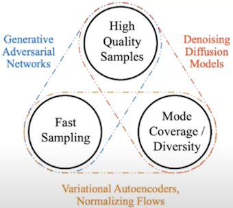
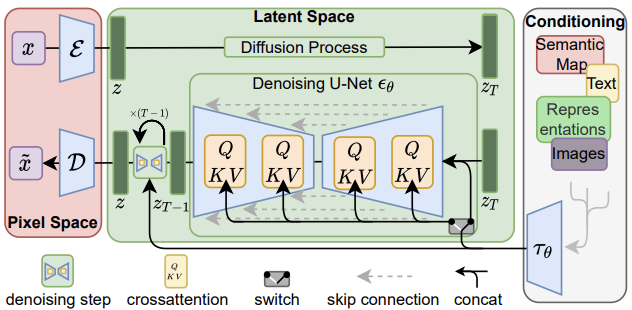

# [Day14] Stable Diffusion，來吧

Author: Nick Zhuang
Type: AI & Data

## 提要

- [前言](#前言)
- [什麼是Stable Diffusion](#什麼是stable-diffusion)
- [Stable Diffusion的演算法](#stable-diffusion的演算法)
- [Stable Diffusion的特色](#stable-diffusion的特色)

## 前言

~~首先感謝大家聽了前面13天的廢話（誤~~
今天我們會介紹 Stable Diffusion 相關的內容，一路鋪陳下來，總算進入了系列文的核心，本日內容包含：什麼是Stable Diffusion、Stable Diffusion的演算法、及Stable Diffusion的特色。
在開始之前，稍微花點時間回顧下之前講述過的內容，可以對照一下差異。

我們前面提過了 [GAN](https://ithelp.ithome.com.tw/articles/10324412)、[DDPM](https://ithelp.ithome.com.tw/articles/10326874)、[VAE](https://ithelp.ithome.com.tw/articles/10323542)、及 [Flow](https://ithelp.ithome.com.tw/articles/10325816) 等模型，可以看到主要以三種維度做區分，其中：GAN 適合生成高品質的影像及能夠快速生成，DDPM 相較於 GAN 來說生成較慢、但模式覆蓋/多樣性較好，至於 VAE 及 Flow 是生成高品質影像較差。

## 什麼是Stable Diffusion

Stable Diffusion 是基於 Diffusion 去改良的模型，主要的概念與 Diffusion 類似，一樣是擴散及去躁的兩過過程，只是它與 Diffusion 不同的是，它是將這兩個過程映射到潛空間 ( Latent Space )，進而減少原本 Diffusion 的運算量，並提升在少量訓練的情況下的模型精度，也就是能生成高解析度的圖片，研究團隊在5萬張樣本做了訓練測試，使用單張 A100 的 GPU 大約花了5天即完成，驗證了單卡訓練的可行性，不同於以往使用大量 V100 的 GPU 訓練 100-1500 天起跳，可見其進展的幅度，下一節我們會拆解其架構，並解釋其中的原理。

## Stable Diffusion的演算法

先上架構圖，如下圖所示。

首先，紅色區塊，會有一個訓練好的自編碼器 ( Auto Encoder )，這是一個泛用的壓縮模型，可以用來生成不同的 Diffusion Model，整體的壓縮流程其實經過了兩個階段：第一階段做感知壓縮 ( perceptual compression )，這是將高頻訊息移除並保留細微語意變化 ( semantic variation ) 的部分，第二階段做語意壓縮 ( semantic compression )，為的是要找到感知等價但運算量更少的空間，就是下段綠色區塊要做的事情。

其次，綠色區塊，擴散的過程當中，因其使用了似然生成模型 ( likelihood-based generative model )，所以可以更關注重要的語意訊息 ( semantic message )，並更快速的訓練模型，在一個低維度的空間收斂，這就是 Latent Diffusion Model。去躁的階段，引入了 Conditioning Mechanisms，在既有 DDPM 的架構底下，允許不同型態的輸入；例如，文本、影像、及其他等，透過交叉注意力 ( cross attention ) 的機制去強化 Unet 所學習到的內容。

## Stable Diffusion的特色

總結來說，Stable Diffusion 改良了部分 Diffusion 的缺點，它將高維度的二維訊息轉換到低維度的空間處理，除了保留原始圖像的精細度外，也忽略不必要保留的細微訊息，所以訓練模型的時間節省很多，它也允許以文生圖、以圖生圖、以景生圖 ( 這部分與 ControlNet 相關 )、提高解析度、及圖片修補等操作，這承襲了 Diffusion 的特性，不過它也是有些限制，因爲其捨棄了原始 DDPM 在 Pixel Space 的 sampling操作，所以對於極度細緻的影像生成，會有其難度，而雖然它降低了運算量，但是生成的時間比 GAN 要更長，再來期待後續的架構優化了。

## 小結

今天我們介紹了關於 Stable Diffusion 的內容；例如，什麼是Stable Diffusion、Stable Diffusion的演算法、及Stable Diffusion的特色，明天會介紹 Stable Diffusion的安裝，明天見！

## 參考連結

- [High-Resolution Image Synthesis with Latent Diffusion Models](https://arxiv.org/pdf/2112.10752.pdf)
- [從頭開始學習Stable Diffusion：一個初學者指南](https://reurl.cc/dmWYLq)
- [Diffusion Models Beat GANs on Image Synthesis](https://arxiv.org/pdf/2105.05233.pdf)
- [知乎-High-Resolution Image Synthesis with Latent Diffusion Models](https://zhuanlan.zhihu.com/p/562413185)
- [Youtube-High-Resolution Image Synthesis with Latent Diffusion Models](https://www.youtube.com/watch?v=LytU887jCvU)
