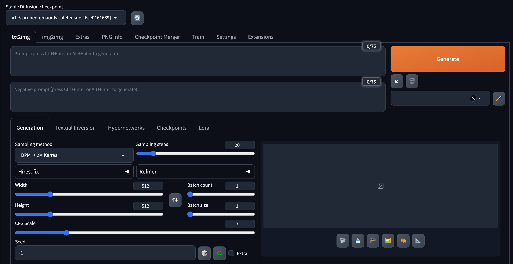

# [Day15] Stable Diffusion的安裝

Author: Nick Zhuang
Type: AI & Data

## 提要

- [前言](#前言)
- [前置準備](#前置準備)
- [環境選定](#環境選定)
- [SD的安裝](#sd的安裝)

## 前言

昨天我們介紹了關於 Stable Diffusion 的內容(後面簡稱SD)，今天我們從安裝開始，一步步手把手示範如何使用SD，內容包含：前置準備、環境選定、及SD的安裝。

## 前置準備

我們先看下自有的電腦配置，目前可建置的[參考網址](https://github.com/AUTOMATIC1111/stable-diffusion-webui)，這是一個構建stable-diffusion-webui的網站，安裝好後可以有 UI 的網頁畫面供操作，要注意的是要用哪種運算資源做 AI 生圖，目前支援：NVIDIA 的 GPU、AMD 的 GPU、及 Intel 的 CPU，建議是用NVIDIA 的 GPU，按照之前的使用經驗，在跑生圖的時候，vram至少要6G以上才會比較穩，但如果是要訓練 ckpt 或 safetensors 那些的話，建議是10G以上，不然跑不動，雖然它有提供降低 vram 附載的參數，但如果資源不夠的時候還是有機會掛掉，另外它也有支援純 CPU 運行的模式，但這部分筆者就沒試了，也不建議嘗試啦，高機率會浪費時間，這邊小結一下：

1. GPU: NVIDIA GPU vram 至少6G，建議10G以上會更好。
2. CPU: vcore 至少4或以上。
3. RAM: 16G以上，跑圖比較不會掛掉，訓練也穩。
4. 一顆學習的心: 因為接下來的操作很吃手動，目前SD更版週期為2~3週左右，有時碰到新問題還得自行排查，先打下預防針，另外有些bug是版本問題造成的，不幸碰到得先速速降版，不然就沒得用啦！

## 環境選定

筆者是用 Docker 環境下去安裝的，基礎映像使用 Ubuntu:22.04，若讀者為 Windows 的情況請參考[這裡](https://github.com/AUTOMATIC1111/stable-diffusion-webui#automatic-installation-on-windows)，以下會以 Docker 及 Ubuntu:22.04 的情況進行示範。

**以下操作不限於Ubuntu，都是Linux based指令**

- CPU檢查

```
test@ubuntu22:~$ lscpu
Architecture:                       x86_64
CPU op-mode(s):                     32-bit, 64-bit
Byte Order:                         Little Endian
Address sizes:                      39 bits physical, 48 bits virtual
CPU(s):                             16
On-line CPU(s) list:                0-15
Thread(s) per core:                 2
Core(s) per socket:                 8
Socket(s):                          1
NUMA node(s):                       1
Vendor ID:                          GenuineIntel
CPU family:                         6
Model:                              165
Model name:                         Intel(R) Core(TM) i7-10700 CPU @ 2.90GHz
```

- GPU檢查
  (這招不用nvidia-smi，萬一驅動掛掉還能用！但要先跑update-pciids激活，才能顯卡型號。)

```
test@ubuntu22:~$ lspci -nn |grep '\[03'
01:00.0 VGA compatible controller [0300]: NVIDIA Corporation AD102 [GeForce RTX 4090] [10de:2684] (rev a1)
```

- RAM檢查

```
test@ubuntu22:~$ free -h
              total        used        free      shared  buff/cache   available
Mem:           62Gi       3.6Gi        47Gi        19Mi        11Gi        58Gi
Swap:            0B          0B          0B
```

- 一顆學習的心

相信自己可以做到，若是心不安，就買一包綠色乖乖放在測試機旁邊。

## SD的安裝

- Docker安裝

老生常談，請看以下示範，或參考[這裡](https://docs.docker.com/engine/install/ubuntu/)。

```
# Add Docker's official GPG key:
sudo apt-get update
sudo apt-get install ca-certificates curl gnupg
sudo install -m 0755 -d /etc/apt/keyrings
curl -fsSL https://download.docker.com/linux/ubuntu/gpg | sudo gpg --dearmor -o /etc/apt/keyrings/docker.gpg
sudo chmod a+r /etc/apt/keyrings/docker.gpg

# Add the repository to Apt sources:
echo \
  "deb [arch="$(dpkg --print-architecture)" signed-by=/etc/apt/keyrings/docker.gpg] https://download.docker.com/linux/ubuntu \
  "$(. /etc/os-release && echo "$VERSION_CODENAME")" stable" | \
  sudo tee /etc/apt/sources.list.d/docker.list > /dev/null
sudo apt-get update
sudo apt-get install docker-ce docker-ce-cli containerd.io docker-buildx-plugin docker-compose-plugin
```

- 安裝驅動

```
sudo apt install nvidia-driver-525-server -y
sudo reboot
```

安裝完驅動一般來說會自動幫你更新kernel到最新，這是正常的。

- 啟動容器

```
sudo docker run --gpus '"device=0"' --network host --name test1 -it ubuntu:22.04 bash
```

這邊指用到了第一張GPU及映射主機網路設定與容器內同步。

- 安裝SD
  (裝在容器內，可以自行封裝image另用，就不用重新建置了！)

```
# 先看能否抓到顯卡
nvidia-smi
# 安裝依賴包
apt update
apt install wget git python3 python3-venv libgl1 libglib2.0-0
# 下載UI運行腳本
wget -q https://raw.githubusercontent.com/AUTOMATIC1111/stable-diffusion-webui/master/webui.sh
chmod +x webui.sh
# 進行安裝並啟動SD
./webui.sh -f --listen
```

跑完後他會開在預設的端口 7860，就能直接連啦！
輸入--help可以看其他常用參數。

如果你懶得自己裝，筆者有個封裝好的可以直接用：

```
sudo docker run --gpus '"device=0"' --network host --name test1 -it 105552010/sd-test:v1.6.0 bash
```

介面會長這個樣子：



## 小結

今天我們介紹了關於 SD 安裝的內容；例如，前置準備、環境選定、及SD的安裝，明天會介紹SD常用操作的內容，明天見！

## 參考連結

- [SD Installation](https://github.com/AUTOMATIC1111/stable-diffusion-webui)
- [Docker Installation](https://docs.docker.com/engine/install/ubuntu/)
