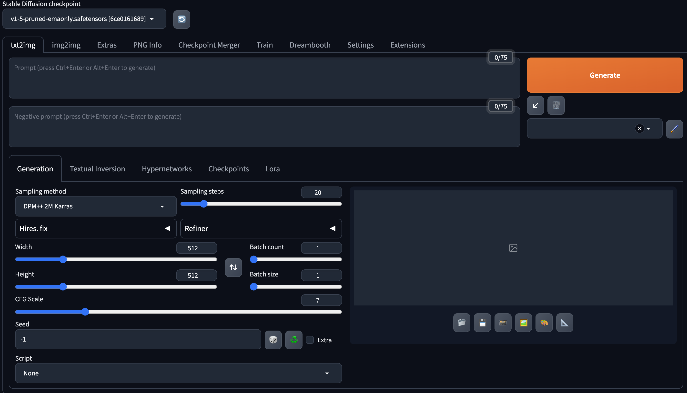

# [Day16] Stable Diffusion的基礎使用

Author: Nick Zhuang
Type: AI & Data

## 提要

- [前言](#前言)
- [介面概覽](#介面概覽)
- [文生圖](#文生圖)
- [圖生圖](#圖生圖)

## 前言

今天我們會學習基礎的 SD 使用，內容包含：介面概覽、文生圖、及圖生圖。

## 介面概覽

介面圖如下所示。

可以看到操作參數非常之多，筆者第一次看到差點沒暈倒，我們只要先關注最左邊的兩個分頁就好，就是txt2img和img2img，這是文生圖、圖生圖的功能位置，最左上方，可以看到v1.5-prune的那個選項，代表已經載入可使用的checkpoint，主Model就是用這個，如果有需要其他選項，可以自行到[這裡](https://civitai.com/)下載。

## 文生圖

以下圖方式作為示範，像筆者輸入提示詞 ( prompt ):8k, beautiful scene, midnight, dark, lake with forest, moon，效果如下：

這邊說明下用到的參數：

1. Sampleing method：這是生成的方式，很多選項，可以比較看看生成的差異。
2. Sampling steps：次數調越高，精細度會越高，建議是30以下。
3. Width、Height：解析度。
4. Batch Count：要生成幾張。
5. Batch Size：從幾張中挑出來生成，調越高品質越好，但時間變長。
6. CFG Scale：很少改，維持7就行，這是控制圖像生成過程中的細節程度的參數。
7. Seed：亂數種子，固定的話每次生成的圖片都一樣。

## 圖生圖

這邊示範簡單的圖生圖，搭配Inpaint，點那個調色盤。

接著到圖生圖的分頁，將要改的地方塗掉。

可以看到原本的月亮被塗掉後，它幫筆者生成了一個超級藍月，看起來效果還可以。

提示詞的使用，越前面的權重會越大，代表越重要，所以在這邊要把midnight排在月亮前面，不然白天生成的月亮就變成是很暗的太陽，看起來就會很奇怪，後續篇幅足夠的話，筆者看能否有機會完整介紹下prompt的使用規則及方式，敬請期待！

## 小結

今天我們介紹了關於 SD 基礎的內容；例如，介面概覽、文生圖、及圖生圖，明天會介紹 Embedding，明天見！

## 參考連結

- [Stable Diffusion基礎 -- 文生圖（txt2img）](https://vocus.cc/article/646dac3ffd897800010015f4)
- [Stable Diffusion基礎 -- 圖生圖（img2img）](https://vocus.cc/article/64756b85fd8978000160a084)
- [Stable Diffusion基礎 -- 局部重繪（inpaint）](https://vocus.cc/article/64770591fd89780001729605)
