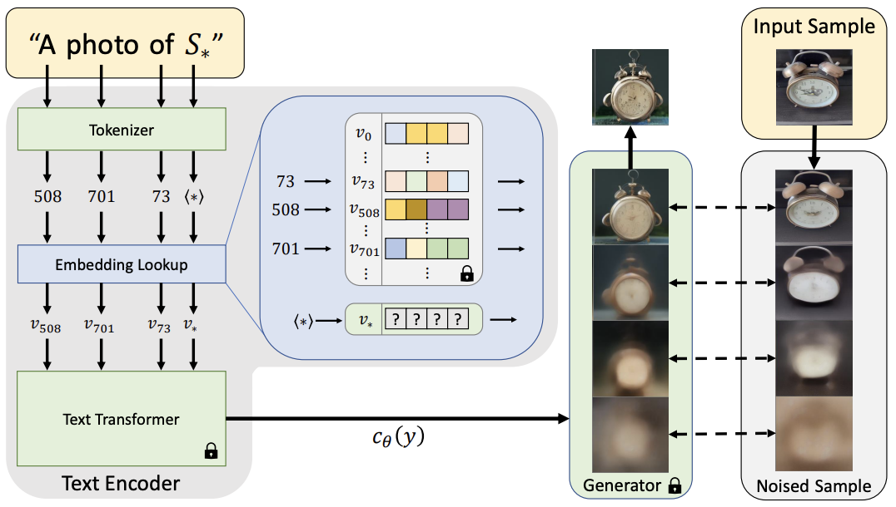

# [Day17] 來看看文本倒置是要倒轉什麼: Embedding

Author: Nick Zhuang
Type: AI & Data

## 提要

- [前言](#前言)
- [什麼是Embedding](#什麼是embedding)
- [Embedding的方法](#embedding的方法)
- [Embedding的使用](#embedding的使用)

## 前言

今天我們介紹 Embedding 相關的內容，Embedding是一種從少量範例影像中捕捉新穎概念的技術。以不改動整個模型參數的方式去微調模型，其他類似方法還有LoRA、HyperNetwork，本日內容包含：什麼是Embedding、Embedding的方法、及Embedding的使用。

## 什麼是Embedding

Embedding 是一種尋找詞嵌入的方法，又稱作 Text inversion，它主要的概念是透過既有架構底下去尋找新詞作為詞嵌入的表示，藉此找到新概念並嵌入到 Latent Diffusion Model 當中，在訓練模型的時候，我們已經知道，大型語言模型重新訓練是非常吃算力的，會很需要大量的顯示卡以加速訓練的速度，有鑑於此，有人進而去思考以微調 ( fine tuning ) 的方式去優化模型，傳統的方法我們會使用 Linear Probe，它是透過凍結不需要訓練的層數，只開放少數層訓練，進而快速調整模型結構以適應新的任務，然而，這樣的方法存在些問題，另外訓練的這些「適應層」 會有遺忘先驗知識 ( prior knowledge ) 的問題，以詞嵌入的方法 Embedding 可以解決這樣的問題。

## Embedding的方法

先上架構圖，如下所示。



主要的核心概念是以「虛擬詞」作為詞嵌入 ( token embedding )，讓我們可以使用文本加上幾張圖片(3~5張)，實現個人化的文生圖功能。因其方法是Textual inversion，我們可以先回顧下它比較過的方法；例如，GAN inversion、Diffusion-based inversion。

訓練一個生成模型通常是以找到對應圖像映射至「潛在表示 ( latent representation ) 」的規則作為判斷標準，這樣的方法稱為 inversion，像訓練 GAN 的過程就會以「潛向量 ( latent vector )」作為輸入，或是以訓練 編碼器 ( encoder ) 的方式也可以，至於訓練 Diffusion-based 的模型就會以找到「潛空間 ( latent space )」為基準，為了要找到潛在表示，所以會用擴散及去噪的方法以實現，但這方法會改動到原本的圖像，因此還有優化空間，Textual inversion 不使用轉換潛空間的方法，是以尋找 pseudo word 方式來做。

流程上主要改進了 Text Encoder 中的詞對照表，透過添加一個特殊的token S_\*來實現，這樣就不會動到原本的對照表，可以保留原本的概念 ( token embedding )，也能學到些新的東西，為了學習v_\*，它模仿了 CLIP 中用到的prompt，按照這個學到的文字生成圖片與輸入的圖像做對照，藉此學習到新的v_\*的詞嵌入，以重建損失來優化token S_\*，學好了之後就能以此規則生成圖像了。

小結一下，Textual inversion 改進了既有 Latent Diffusion Model 的方法，它不需要重新訓練模型，只要訓練一個新的Embedding就可以，這樣可以在使用一個SD模型的情況底下去生成客製化的圖片，進而達成文生圖的「個人化」、相同物體生成效果較好、能適度引入新概念的圖生成且不扭曲、可實現風格遷移及概念合成等優點，不過還是有些限制，像是它無法學習到精確的細節、訓練prompt的時間偏長等問題。

## Embedding的使用

這節我們看下如何使用 Embedding 的功能，先啟動SD的介面

- 開啟容器

```
sudo docker run --gpus 1 --network host --it 105552010/sd-test:v1.6.0 bash
```

- 啟動SD

```
./webui.sh -f --enable-insecure-extension-access --listen
```

啟動後，切換到Train的分頁。


定義好Name及其他設定後就能訓練Embedding了，Good Luck！

## 小結

今天我們介紹了關於 Embedding 的內容；例如，什麼是Embedding、Embedding的方法、及Embedding的使用，明天會介紹DreamBooth，明天見！

## 參考連結

- [An Image is Worth One Word: Personalizing Text-to-Image Generation using Textual Inversion](https://arxiv.org/pdf/2208.01618.pdf)
- [An Image is Worth One Word: Personalizing Text-to-Image Generation using Textual Inversion-知乎](https://zhuanlan.zhihu.com/p/552277937)
- [Textual Inversion: A method to finetune Stable Diffusion Model](https://medium.com/@onkarmishra/how-textual-inversion-works-and-its-applications-5e3fda4aa0bc)
