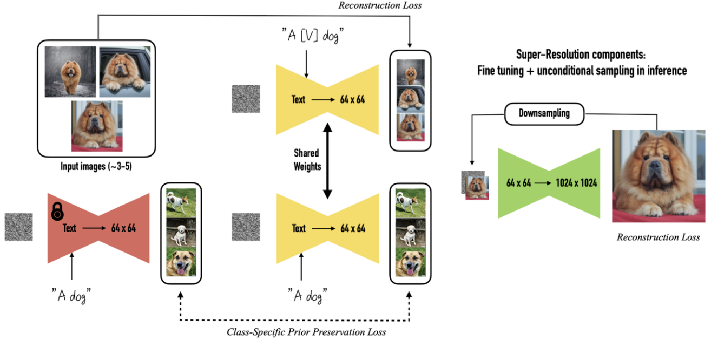

# [Day18] Dreambooth，夢幻般的驚嘆調

Author: Nick Zhuang
Type: AI & Data

## 提要

- [前言](#前言)
- [什麼是Dreambooth](#什麼是dreambooth)
- [Dreambooth的方法](#dreambooth演算法)
- [Dreambooth的使用](#dreambooth的使用)

## 前言

今天我們介紹 Dreambooth 相關的內容，Dreambooth是2022年Google團隊發表的一項技術，它是一種訓練SD模型的方式，其他的另外三種方式分別是；LoRA、Embedding、HyperNetwork，後面會逐一介紹，本日的內容包含：什麼是Dreambooth、Dreambooth的方法、及Dreambooth的使用。

## 什麼是Dreambooth

以下是Google團隊針對命名的說明。

> It’s like a photo booth, but once the subject is captured, it can be synthesized wherever your dreams take you.

這個方法主要是對於 Text2Image，也就是以文生圖的一種改進方法，使得在文生圖的情況底下，能夠生成「個人化」的圖片，主要用到了微調 ( fine tuning ) 的方法，實驗中只要用3~5張圖片即可達成不錯的表現，另外，與 Embedding 不同的是，它是將整個模型做微調，沒有用到Frozen layer，還記得我們前面講過 Linear Probe 的概念嗎？所以它相對於 Embedding 來說，可以生成更接近的圖像。

> 編按：Embedding 指的是 Textual Inversion論文中用到的方法。

## Dreambooth的方法

首先，先上架構圖。

可以看到先輸入了3~5張的狗狗照片，這邊同樣用到了 CLIP 的技術，將一組 key pair 輸入至 DreamBooth 做訓練，DreamBooth 本身會新建一個獨有的關鍵符去標示這個特徵，而在 Inference 的時候，就會依此規則輸出對應的合成圖像 ( Synthesis Image )。

DreamBooth 使用到的方法與 Embedding 有些許不同，第一，Embedding 是從既有詞彙當中去尋找詞嵌入去標示這個特徵，而 DreamBooth 是創造一個新的關鍵詞，並加入該類別名稱去微調整個模型，換言之，Embedding 生成的效果上的變化會比 DreamBooth 要少，因為會侷限於原本的範圍；再者，因為 DreamBooth是針對整個模型做微調，所以它的效果會比較好；次者，它用到了 Class-Specific Prior Preservation Loss，這是一個將 \[Identifier\] 標示詞拓展考慮其類別先驗的方法，原本只會以 \[Identifier\] 的單個詞嵌入做訓練，他們發現這樣效果並不好，所以後來改成類別先驗 ( Class Prior ) 的方式，變成以 \[Identifier\] \[Class noun\] 去做訓練，這樣生成圖片的效果會好很多，因此，Class-Specific Prior Preservation Loss 這個方法避免了過擬合 ( overfitting ) 及 語言偏移 ( language drift )，語言偏移指的是模型微調後遺忘之前學過的內容。

## Dreambooth的使用

這節我們要將 DreamBooth 的使用實際應用在 SD 上面，參考下圖。

切到Extension那個分頁，按下Load from，下面可以找到 DreamBooth 的 Extension：

按 Install 後它會自動安裝，若有問題就需自行下載並下指令安裝。

按下 Apply and restart UI，等它激活這個插件。

可以看到安裝好後，多了一個DreamBooth的分頁，接下來就可利用這頁自行訓練要用的checkpoint。

## 小結

今天我們介紹了關於 Dreambooth 的內容；例如，什麼是Dreambooth、Dreambooth的方法、及Dreambooth的使用，明天會介紹LoRA相關的內容，明天見！

## 參考連結

- [DreamBooth: Fine Tuning Text-to-Image Diffusion Models for Subject-Driven Generation](https://arxiv.org/pdf/2208.12242.pdf)
- [DreamBooth Paper Explanation Slide](https://www.crcv.ucf.edu/wp-content/uploads/2018/11/Dreambooth-Paper-5.pdf)
- [Dreambooth微調Stable Diffusion實現txt2img個人化生成](https://zhuanlan.zhihu.com/p/625848905)
- [精通Stable Diffusion畫圖，理解LoRA、Dreambooth、Hypernetworks四大模型差異](http://www.gamelook.com.cn/2023/04/513756)
- [HuggingFace-DreamBooth](https://huggingface.co/docs/diffusers/training/dreambooth)
