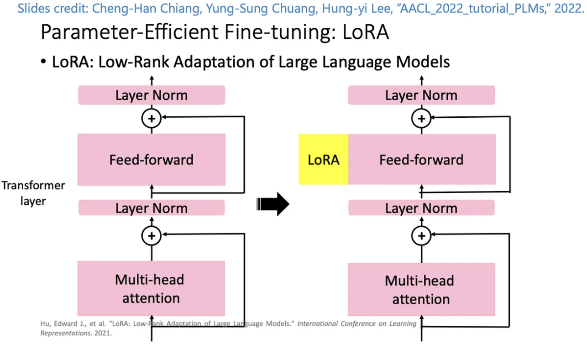
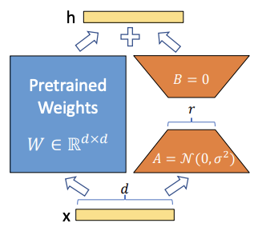

# [Day19] LoRA，微調方法的新突破

Author: Nick Zhuang
Type: AI & Data

## 提要

- [前言](#前言)
- [什麼是LoRA](#什麼是LoRA)
- [LoRA的演算法](#LoRA演算法)
- [LoRA的特色](#LoRA的特色)

## 前言

今天我們介紹 LoRA 相關的內容，LoRA是一種微調 ( fine tuning ) 模型的方式，內容包含：什麼是LoRA、LoRA的演算法、及LoRA的特色。

## 什麼是LoRA

LoRA 是微軟團隊在2021年提出的一種微調方法，它主要的概念是從pre-trained Model來的，一般來說，我們在使用預訓練的模型時候，會凍結已經訓練好的層，僅訓練新加入的層，就在前面有提過，就是Linear Probe，近年來大家開始研究有效率的微調模型，就是Parameter-Efficient Fine-Tuning (PEFT)，LoRA的精神是凍結原本的預訓練模型，像是GPT之類的，並搭配一個小的模型去微調就可以達到不錯的效果，就像 Adaptor 一樣，我們可以將 LoRA 視為一個插件，在特定層插入該模組，讓整個模型可以適應對應問題的處理，參考下圖。

與有微調過的 GPT-3 模型相比，這個方法使用的參數減少了10,000倍，並只有佔用 GPU 3分之1的 loading，也減少了記憶體的使用量，使得這項技術可以應用在 Stable Diffusion 上。

## LoRA的演算法

隨著人工智慧領域的不斷發展，我們見證了語言模型（LLM）和基礎模型（如GPT系列）的崛起，這些模型在自然語言處理中發揮了重要作用。然而，要使這些模型適用於各種不同的下游任務（Downstream tasks）並確保它們在處理這些任務時表現出色，需要採取特定的訓練策略。
Adapter 和 Prefixing 是兩種有效的 Parameter-Efficient Fine-Tuning 做法，使我們能夠在不重新訓練整個模型的情況下，讓語言模型（LLM）在不同下游任務上表現更好。

- Adaptor: 透過凍結模型並添加模塊來訓練。
- Prefixing: 在 Prompt 的前面添加 token 來訓練以增進模型的表現。

LoRA 是基於 Adaptor 的方法，像我們前面看過的 Embedding 是屬於 Prefixing 的方法，它的核心概念就是找到關鍵的特徵參數並對其進行訓練，如下圖所示。

可以看到它是先將預訓練的模型額外接個迴路，A先將維，B再升維，用來模擬 intrinsic rank，這種模型中層與層之間的迴路設計最早我們可以從 ResNet 看到，不過它是跳過的作用，與此例不同。
在 Stable Diffusion 當中，LoRA 是訓練 U-Net 當中的特定層的權重，讓原始的checkpoint模型，進而獲得處理特定任務的能力，生成特定風格及樣式的圖片。

## LoRA的特色

除了基於Adaptor的方法LoRA外，其他方向像是ZeRO-Offload、FlexGen都是近年 PEFT 的方向。
LoRA 有著易於模塊化、低訓練成本（時間、硬體）的優勢，所以在目前的 Stable Diffusion 的應用場景，可以大量見其蹤跡，大小一般來說低於200MB，常見的LoRA可以在[Civitai](https://civitai.com/)、[HuggingFace](https://huggingface.co/docs/diffusers/training/lora)下載。

## 小結

今天我們介紹了關於 LoRA 的內容；例如，什麼是LoRA、LoRA的演算法、及LoRA的特色，明天會介紹HyperNetwork的內容，明天見！

## 參考連結

- [LoRA: Low-Rank Adaptation of Large Language Models](https://arxiv.org/pdf/2106.09685.pdf)
- [LoRA：大型語言模式的低秩適應 簡讀](https://zhuanlan.zhihu.com/p/514033873)
- [微調大型語言模型LLM的技術LoRA及生成式AI-Stable diffusion LoRA](https://reurl.cc/jvlvpL)
