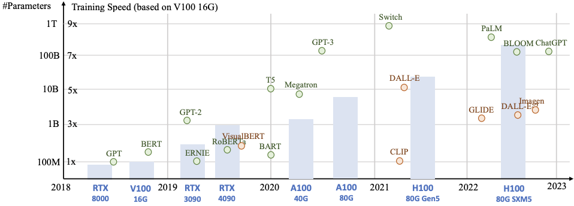
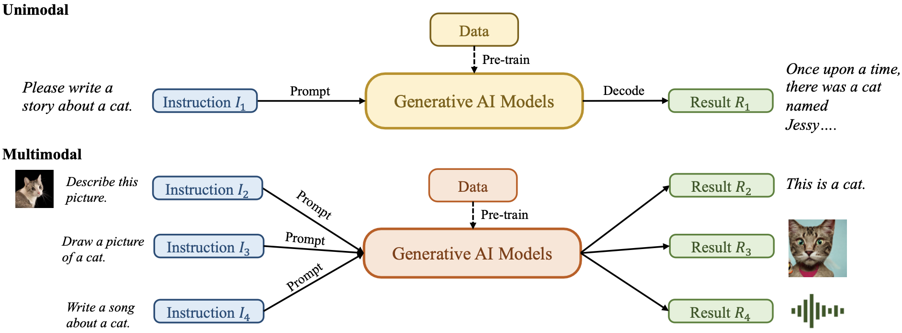
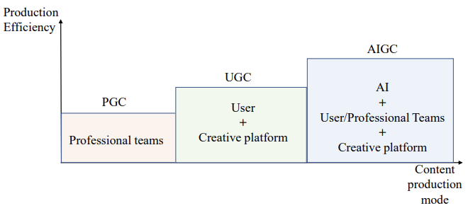
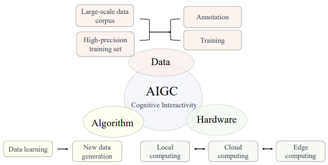

# [Day2] 哎呀!? AIGC是什麼東東

Author: Nick Zhuang
Type: AI & Data

## 提要

- [前言](#前言)
- [什麼是AIGC?](#什麼是aigc)
- [重新定義AIGC](#重新定義aigc)
- [AIGC的組成](#aigc的組成)

## 前言

近年來，隨著 GPU 算力的等級躍升，利用 AI 算圖的商用性也越來越高，為了因應在大型語言模型 ( Large Language Model，LLM ) 的應用下，近期火熱的 ChatGPT、及 Stable Diffusion 的高速發展，進而評估以此方向作為數位轉型的參考，開啟了本次的 AIGC 調研之路。



近年來的GPU算力及LLM的參數量變化，如上圖所示。

## 什麼是AIGC？

AIGC 的全名為 Artificial Intelligence Generated Content，也就是以 AI 的方式生成內容，那麼如何以 AI 的方式生成內容？

我們先來看看 ChatGPT 怎麼說：

```
利用AI生成內容是一種自動化技術，可以使用自然語言處理和機器學習等技術來生成文本。
這種技術可以應用在各種場景中，例如生成新聞報導、寫作文章、產生文本摘要等。
AI生成內容可以幫助人們快速生成大量的文本內容，提高生產效率，並減少錯誤率。
不過需要注意的是，AI生成的內容可能存在一些語言流暢度和邏輯結構上的問題，需要人工進行檢查和修正。
此外，利用AI生成內容也存在一些倫理和法律問題，例如版權問題、信息真實性問題等。
因此，在使用AI生成內容技術時，需要對其進行評估和監督，確保所生成的內容符合相關的規範和要求。
利用AI生成內容的應用越來越廣泛，尤其是在新聞報導、商品描述、網站內容、社交媒體等領域。
使用AI生成內容可以快速生成大量的文本內容，並且可以根據不同的需求和目的生成相應的內容。
例如，在電商平台上，可以利用AI生成內容來自動化生成商品描述，提高商品信息的詳盡程度和覆蓋面，從而提高消費者的購買決策能力。
在新聞報導方面，AI生成內容可以幫助新聞機構快速生成新聞稿件，提高新聞報導的速度和效率，從而更好地滿足讀者對新聞的需求。

然而，AI生成內容也存在一些挑戰和問題。例如，由於AI生成內容的算法和模型是基於訓練數據來實現的，
因此訓練數據的質量和結構對生成內容的質量和效果有著至關重要的影響。此外，AI生成的內容可能存在一些語言流暢度和邏輯結構上的問題，
需要人工進行檢查和修正。因此，在使用AI生成內容技術時，需要對其進行評估和監督，確保所生成的內容符合相關的規範和要求。

總之，利用AI生成內容是一種有望提高生產效率和降低成本的技術，但也需要注意其潛在的問題和風險，並採取相應的措施來保證其質量和合法性。
```

小結一下，它主要的意思：

1. AIGC 是一種自動化技術，可以用來生成文本。
2. AIGC 生成的內容可能會有語言或邏輯上的問題，源自於數據和算法是否合適。
3. AIGC 生成的內容可能會有倫理或法律的問題，源自於數據來源是否合法。
4. AIGC 有潛在的應用領域；例如，新聞報導、商品描述、網站內容、及社交媒體。

當然，這其實不夠嚴謹，探討事物我們必須要先有嚴格的定義，並在固定的場域下去比較它與原先的做法有何不同。

## 重新定義AIGC

AIGC 的出現其實受惠於近年的 GPU 進化，它是來自於生成式AI ( GAI, Generative AI ) 的演算法，並進一步將其做了改良，總結來說，該架構允許給予多個提示詞 (prompt)，並輸出一段合理的內容，如下圖所示。



這邊給到的例子，給予提示詞讓模型輸出對應的內容；例如，Unimodal、及Multimodal，允許使用者作單個或多個輸入。

所以，AIGC 是基於 GAI 所改良的演算法，能夠允許多重輸入並自動化輸出我們要的結果。

## AIGC的組成

### GAI的模式

由下圖可以看到，GAI 分成三種模式，一種是基於 PGC ( Professional Generative Content )，要生成內容必須要由專業人士操刀，另一種是基於 UGC ( User Generative Content)，透過一般使用者加上生成式平台來生成內容，但因為缺乏專業知識，所以生成出的內容需要再經過人工調整，最後一種方式就是 AIGC ( AI Generative Content )，生成不會再被專業知識所侷限，可以透過生成式平台，下一些關鍵字 ( keyword ) 或是提示詞 ( prompt )，就能夠生成專業級的內容，且人工也難以辨別是 AI 所生成的內容。

所以，AIGC是一種 GAI 的模式，它是基於 PGC、及UGC的綜合體，結合了兩者的優點。



### AIGC的構成要件

要能讓AIGC運作，必須要滿足三個條件，分別是：資料、演算法、及硬體。透過資料中的數據去驅動，就可以實作以資料為基底的演算法，並以此利用硬體去訓練模型，就大功告成。



## 小結

本日我們重新回顧了 AIGC 的定義，並探討了相關的組件，我們理解了 AIGC 的意義，是一個基於 PGC + UGC 的架構，明天我們將會以此作為基礎，進階去檢視 AIGC 的特色、及應用，明天見！

## 參考連結

- [AI-Generated Content (AIGC): A Survey](https://arxiv.org/pdf/2304.06632.pdf)
- [A Comprehensive Survey of AI-Generated Content (AIGC):A History of Generative AI from GAN to ChatGPT](https://arxiv.org/pdf/2303.04226.pdf)
- [AI應用與影響](https://www.businessweekly.com.tw/focus/blog/3011901)
- [什麼是AIGC？](https://ezbacklink.net/what-is-generative-ai/)
