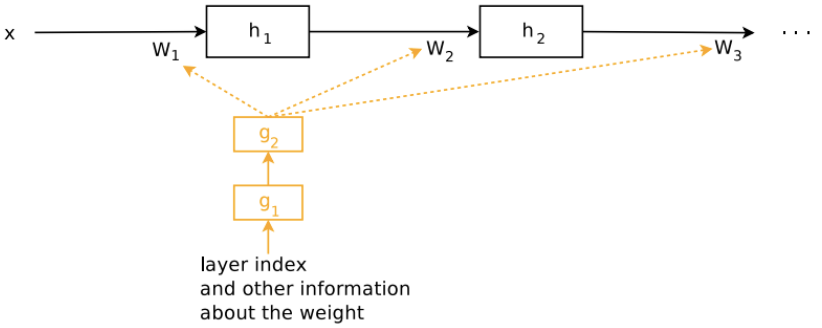
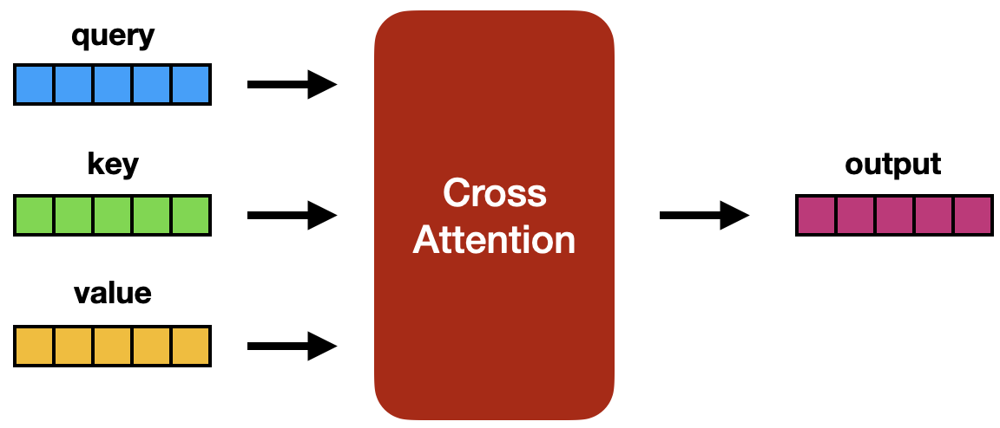
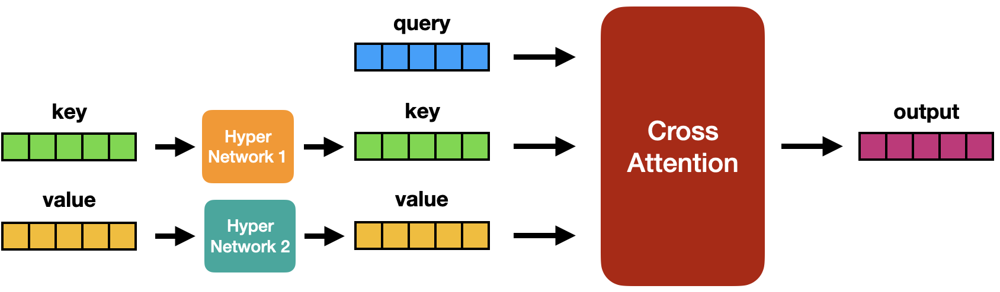
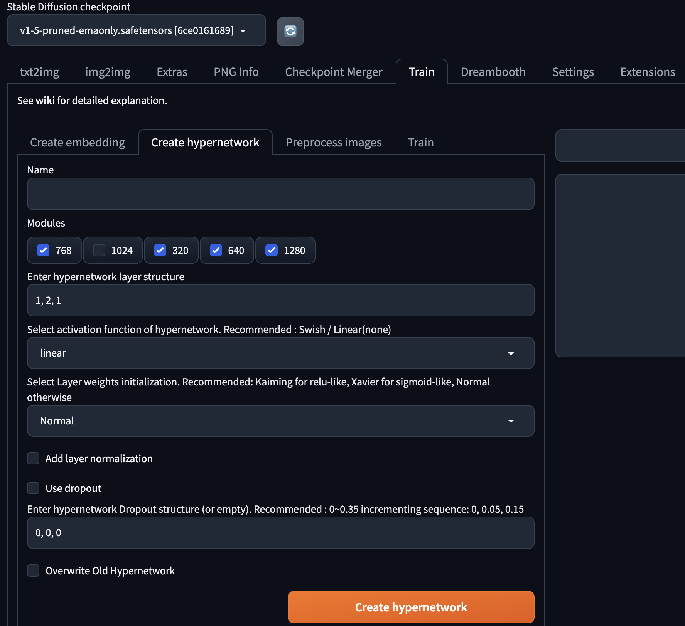

# [Day20] HyperNetwork，感覺很高級

Author: Nick Zhuang
Type: AI & Data

## 提要

- [前言](#前言)
- [什麼是HyperNetwork](#什麼是HyperNetwork)
- [HyperNetwork的方法](#HyperNetwork方法)
- [HyperNetwork的使用](#HyperNetwork的使用)

## 前言

今天我們介紹 HyperNetwork 相關的內容，HyperNetwork 也是一種類似 LoRA 的微調 ( fine tuning ) 模型方法，內容包含：什麼是HyperNetwork、HyperNetwork的方法、及HyperNetwork的使用。

## 什麼是HyperNetwork

HyperNetwork 是一種利用神經網路來生成模型參數的方法，是由早期 Stable Diffusion 開發的參與者 Novel AI發明的，它可以用來從模型內部尋找類似的參數，找到之後以此規則生成類似的圖片。

## HyperNetwork的方法

HyperNetwork 是一種模型微調的方法，與 LoRA 不同的是，它是在 U-Net 的架構底下，加入新的網路模塊，進而修改cross attention模塊的內容，不同於 LoRA 的 Low Rank 方式，架構參考下圖。

我們可以先回顧下原本的 Stable Diffusion 的交叉注意力模塊架構圖，

加入HyperNetwork後的架構如下：

在訓練期間，Stable Diffusion 模型已經被Frozen，但額外添加的 Hypernetwork 允許改變。因為 Hypernetwork 很小，所以訓練時間很短並且只需要少量的運算資源即可。

Hypernetwork 的主要優點是快速訓練和檔案不會很大。這邊要正名一下，HyperNetwork 是一個為另一個網路產生權重的網路，與機器學習中通常所說的超網路不同。所以，Stable Diffusion 的 Hypernetwork 並不是 2016 年發明的。

## HyperNetwork的使用

我們回到 Stable Diffusion 的操作介面，看下HyperNetwork的訓練和使用要如何操作。

基本上可以把 HyperNetwork 視為好幾層的FC ( Fully Connected ) 層，看你中間是否要夾雜 BN ( Batch Normalization ) 層或 Dropout 層，看個人喜好，決定好相關參數後點擊 Create hypernetwork 去訓練新的 HyperNetwork 即可。

如果是要直接使用別人訓練好的 HyperNetwork，可以從[Civitai](https://civitai.com/)下載。

## 小結

今天我們介紹了關於 HyperNetwork 的內容；例如，什麼是HyperNetwork、HyperNetwork的方法、及HyperNetwork的使用，明天會介紹AI影像生成的工具，明天見！

## 參考連結

- [Learning Transferable Visual Models From Natural Language Supervision](https://arxiv.org/pdf/2103.00020v1.pdf)
- [Personalizing Text-to-Image Diffusion Models by Fine-Tuning Classification for AI Applications](https://www.researchgate.net/publication/369476053_Personalizing_Text-to-Image_Diffusion_Models_by_Fine-Tuning_Classification_for_AI_Applications/references)
- [HyperNetworks](https://arxiv.org/pdf/1609.09106.pdf)
