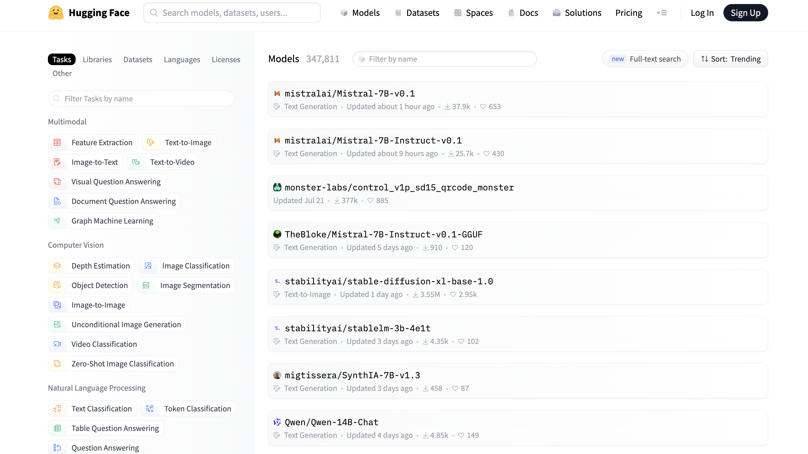

# [Day21] 歡樂下載站：Civitai及HuggingFace

Author: Nick Zhuang
Type: AI & Data

## 提要

- [前言](#前言)
- [Civitai](#civitai)
- [HuggingFace](#huggingface)
- [同場加映](#同場加映)

## 前言

今天我們會介紹可以下載 Stable Diffusion 用到的模型網站；例如，Civitai、HuggingFace。
前情提要，無論是哪邊下載的，要注意最近出的 SD XL，要使用對應的 LoRA 才會生效。

## Civitai

這是一個可以下載主 Model 的地方，以Checkpoints為主，還有一些LoRA，當然也可以找到別的種類，我們前面有介紹過除了主要風格的checkpoint之外，還可以透過DreamBooth重新生成新的checkpoint，或是用比較節省資源的方式，自行下載或創建 LoRA、Embedding、Hypernetwork等等。

點選 Explore all models 後，可以看到上面有各式各樣的模型，這邊簡單幫大家整理下分類：

1. STYLE：風格導向，像是動漫風、寫實風、裡面有各種風格。
2. CLOTHING：服裝相關，卡通人物或是寫實人物都有。
3. BASE MODEL：這裡就是Checkpoint，下載好後，在SD的主頁面上的左上角可以選擇。
4. POSES：這是跟姿勢相關的，可以用來調整生成人物的姿勢，維持固定，這在後面會介紹。
5. BACKGROUND：背景相關的，以LoRA為主，可以套用對應的模組快速抽換背景。
6. TOOL：有些新出的 Extensions 會放在這，插件相關的內容明天會開講。
7. BUILDING：建築物相關，如果要做場景抽換的可以考慮。

其他種類或詳細內容就自行探索，有些種類的選擇比較少，就先跳過了，網頁上可以選擇要顯示的種類，搭配過濾器篩選顯示即可。

## HuggingFace

這是一個很不錯的網站，它有把一些關於基本使用及訓練 LoRA 的相關概念及方式整理在上面，可以參照服用。

可以看到左邊有各種類別的標籤，它這個模型並不限於生成圖像而已，生成文字的也有，還有其他種類等等，至於Civitai 是以圖像生成為主，高度綁定 Stable Diffusion。

## 同場加映

還有一個網站可以參考的是大陸目前最大的生成圖像平台：海藝，上面也有很多資源可以參考，如下圖。

可以看到也有各種不同的風格，像是Cyperpuck、Animation Style等等，若是看到有自己想嘗試的LoRA或Checkpoint也可以下載試試。

## 小結

今天我們介紹了Civitai、HuggingFace、SeaArt相關的內容，明天會介紹 SD 工具相關的好用插件，明天見！

## 參考連結

- [Civitai](https://civitai.com/models?tag=base+model)
- [HuggingFace](https://huggingface.co/models)
- [SeaArt](https://www.seaart.ai/home)
