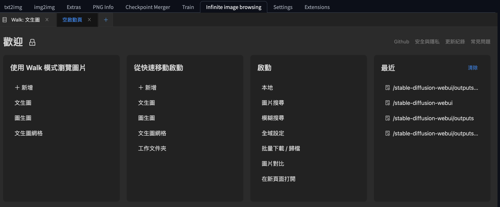
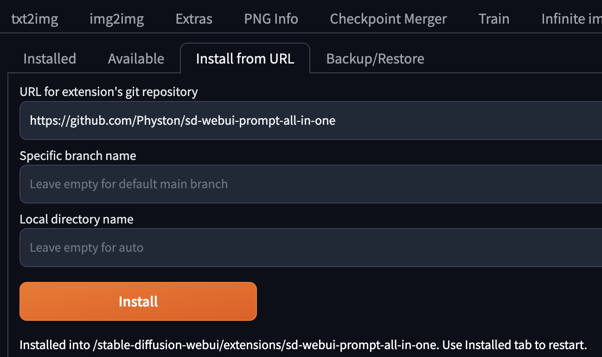
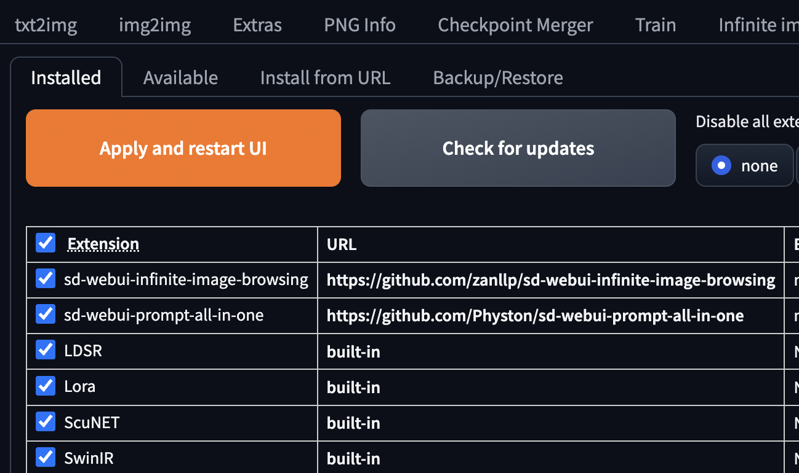
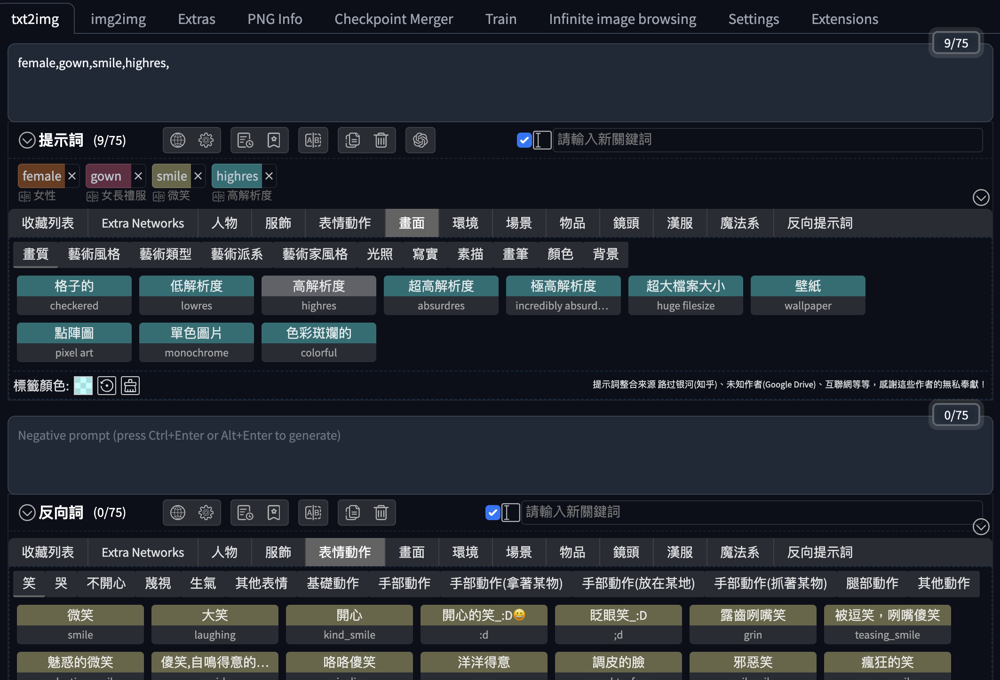
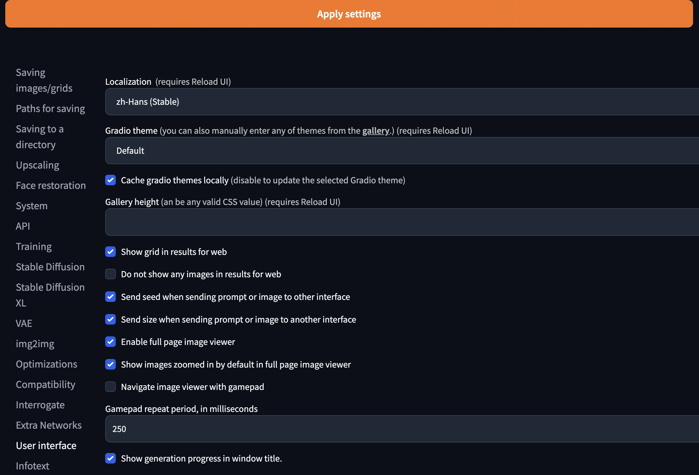

# [Day22] Stable Diffusion 基礎插件

Author: Nick Zhuang
Type: AI & Data

## 提要

- [前言](#前言)
- [Image Browsing](#image-browsing)
- [Prompt all in one](#promp-all-in-one)
- [Translation](#translation)

## 前言

今天我們介紹 Stable Diffusion 插件相關的內容，本日會先介紹三個，內容包含：Image Browsing、Prompt all in one、及Translation。

## Image Browsing

Image Browsing是瀏覽圖片用的，它會幫忙把生成的圖片整理起來，可以縮圖預覽、快速查找、及以巡訪的方式檢視，會羅列一些圖片生成時用的prompt、及其他一些小細節，要批量下載圖片也是可以的，非常方便，以下介紹安裝及使用方式。

- 安裝

切換到Extension的分頁，然後在Install from URL貼上

```
https://github.com/zanllp/sd-webui-infinite-image-browsing
```

點擊Install，然後切換到 Installed 的分頁，按下 Apply and restart UI。

- 使用方式



這是安裝好後的介面總覽，「Walk模式」是巡訪圖片用的、「快速移動」是會幫你顯示資料夾、「啟動」是 Global 的功能，像是：快速查找圖片、批量下載等等。


這是使用walk文生圖的功能顯示的畫面，可以看到有縮圖檢視，以及從單張圖去檢視該圖所使用的prompt、解析度、使用的Model、及其他細部設定。

## Prompt all in one

Prompt all in one這個插件是用在提示詞 ( prompt )使用的，它有各種維度的提示可以直接點選，選了後就自動幫你把對應字填到 prompt 的框內，無論是 Positive 或是 Negative 都可以。

- 安裝



切換到Extension的分頁，然後在Install from URL貼上

```
https://github.com/Physton/sd-webui-prompt-all-in-one
```



點擊Install，然後切換到 Installed 的分頁，按下 Apply and restart UI。

- 使用方式



可以看到有大類別可以供選擇，像是：人物、服飾、表情動作、畫面、...，非常多XD，小類別在點選定大類別後會出現選項，點擊就能把這些標籤放到介面上，並同步幫你把提示詞放上去。

## Translation

最後一個就是翻譯的插件啦！一開始用的時候專有名詞非常多，很容易看到頭昏眼花，為了避免語言障礙影響到我們的使用，因此有好的翻譯插件非常重要。

- 安裝

切換到Extension的分頁，然後在Install from URL貼上

```
https://github.com/hanamizuki-ai/stable-diffusion-webui-localization-zh_Hans
```

點擊Install，然後切換到 Installed 的分頁，按下 Apply and restart UI。

接下來這步驟要注意一下：



這邊是要在 restart UI 後，切換到 Settings -> User interface -> Localization，將語系選擇 zh-Hans，它預設是簡體中文的，所以如果要用繁體版的話，可以將這個路徑底下的json檔修改即可：

```
/stable-diffusion-webui/extensions/stable-diffusion-webui-localization-zh_Hans/localizations
```

## 小結

今天我們介紹了關於 Stable Diffusion 基礎插件的內容；例如，Image Browsing、Prompt all in one、及Translation，明天會介紹 Stable Diffusion 進階插件的內容，明天見！

## 參考連結

- [Image Browsing](https://juejin.cn/post/7256651192986026044)
- [Prompt all in one](https://www.uisdc.com/prompt-all-in-one)
- [Stable Diffusion 基礎插件](https://www.uisdc.com/stable-diffusion-webui-2)
