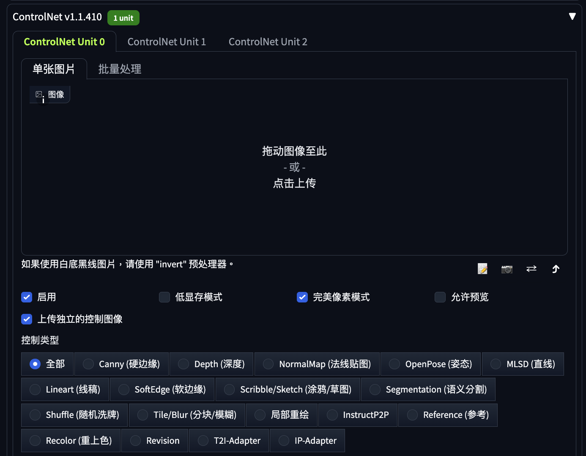
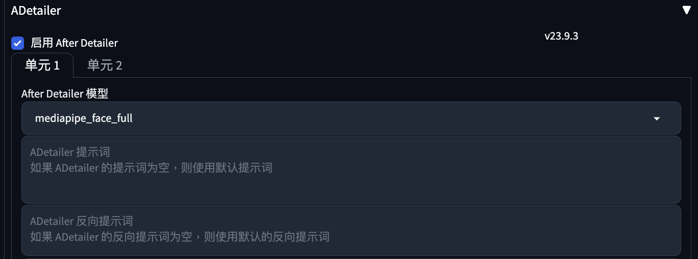
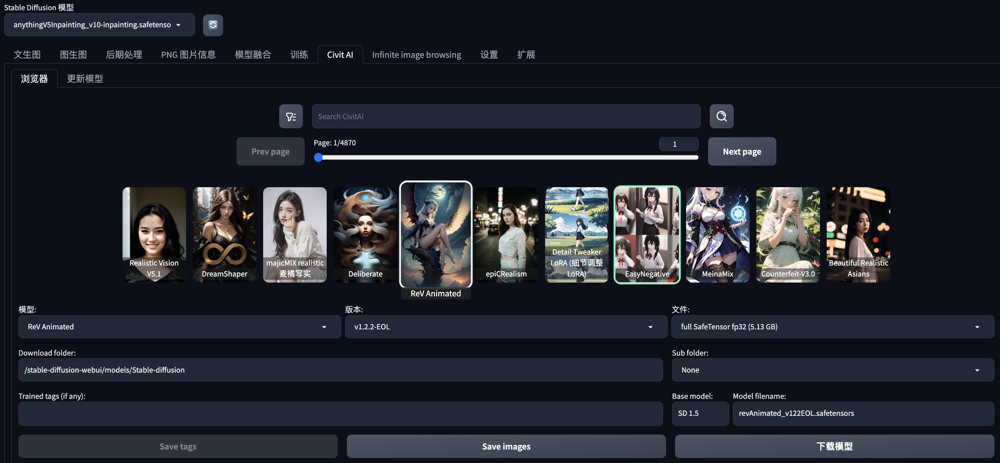
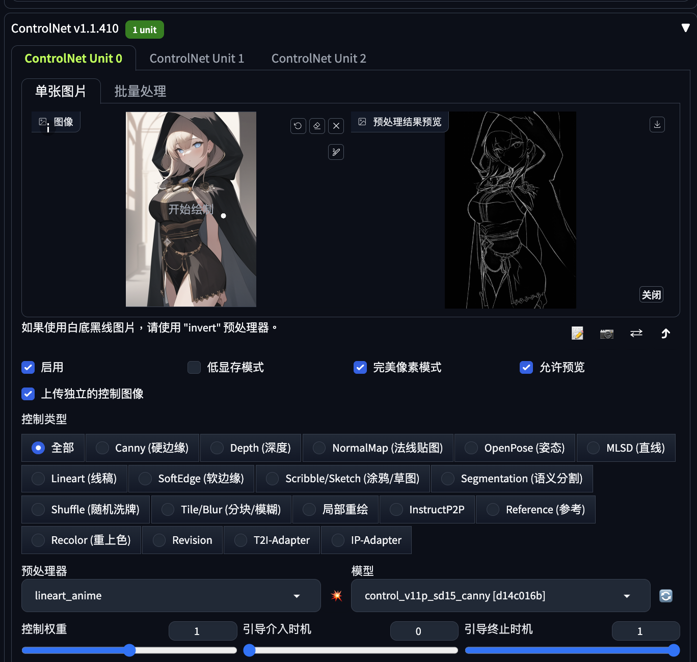
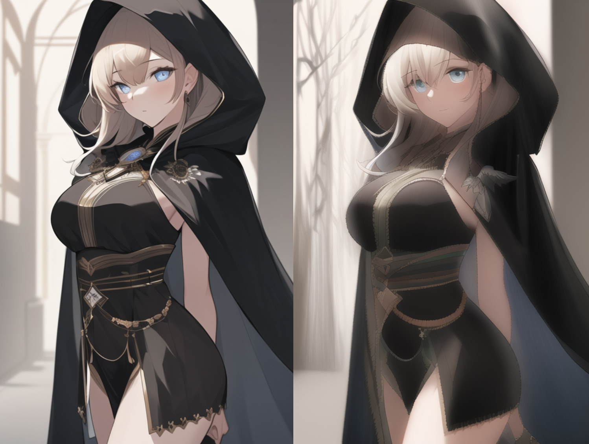

# [Day23] Stable Diffusion 進階插件

Author: Nick Zhuang
Type: AI & Data

## 提要

- [前言](#前言)
- [ControlNet](#controlnet)
- [After Detailer](#after-detailer)
- [Civitai Browser Plus](#civitai-browser-plus)

## 前言

今天我們介紹 SD 進階插件相關的內容，本日內容包含：ControlNet、After Detailer、及 Civitai Browser Plus。

## ControlNet

這個插件是控制邊緣、手勢、姿勢用的插件，我們可以透過其中的設定去調整生成人物的姿態。這個插件可以從 Extension 直接裝，不過其中用到的 model 要另外下載，主插件 URL 如下：

```
https://github.com/Mikubill/sd-webui-controlnet.git
```

至於 model 要到 HuggingFace 下載：

```
https://huggingface.co/lllyasviel/ControlNet-v1-1
```

只要pth的檔案就夠了，不過因為檔案很多，這裡提供一個比較方便的方法，一次下載全部。
首先要安裝git lfs套件，然後在clone。

```
sudo apt-get install git-lfs
git lfs clone https://huggingface.co/lllyasviel/ControlNet-v1-1
```

這樣就全部下載下來了，然後要放到/Stable Diffusion/novelai-webui-aki-v3/extensions/sd-webui-controlnet/models的資料夾底下。
完成後重啟 UI 就能看到操作介面，如下圖。



## After Detailer

這是一款增加繪圖細節的插件，也可以透過 URL 去安裝，安裝好後可以在生圖的介面上操作。



它也可以輸入自己想加入的 prompt，其他參數先用預設就可以，有需要再自行調整。

## Civitai Browser Plus

這個插件可以在 Extension 分頁中的 Download 的下載列表中找到，可以透過介面直接安裝，然後重新載入 UI 即可，非常方便，要看 civitai 的內容就不用刻意切換到網頁上，可以專注在 SD 的操作介面上。



最後我們結合這三個插件來一次操作：

1. 先從civitai下載二次元的模型：anythingV5Inpainting_v10-inpainting。
2. 切換至圖生圖，到 ControlNet 那操作。



按照上圖操作，即可描繪邊緣，這邊筆者要測試邊緣重繪的功能。

3. 所有設定完成，就按生圖。



原圖在左，新圖在右，多了一股朦朧美，可能模糊條太多了囧。

## 小結

今天我們介紹了關於 SD 進階插件的內容；例如，ControlNet、After Detailer、及Civitai Browser Plus，明天會介紹 ControlNet 的原理，明天見！

## 參考連結

- [ControlNet手把手教學](https://www.uisdc.com/controlnet-v1-1)
- [SD實用進階插件](https://www.uisdc.com/stable-diffusion-webui-3)
