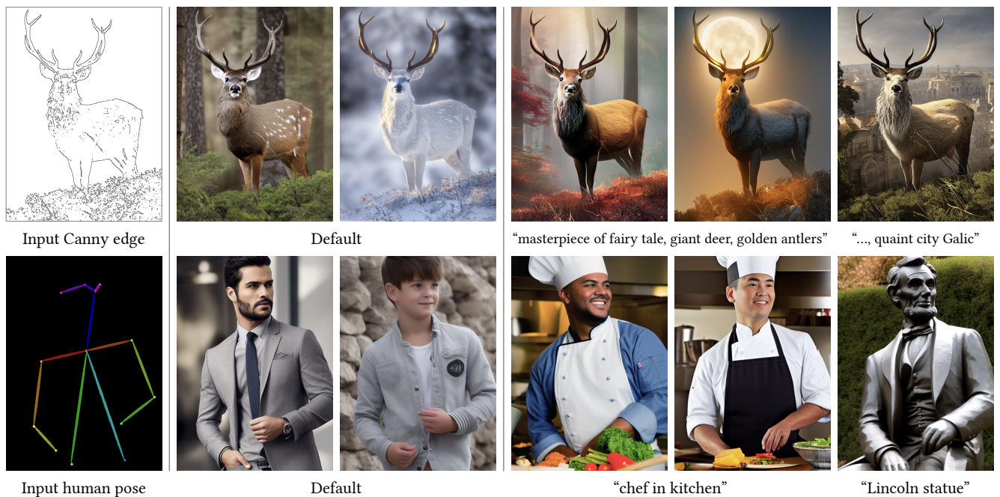
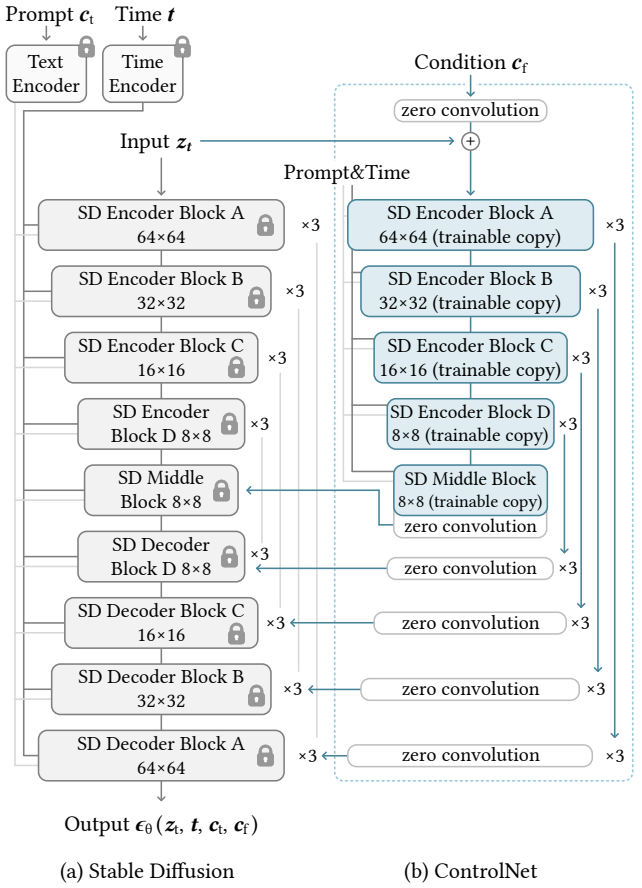
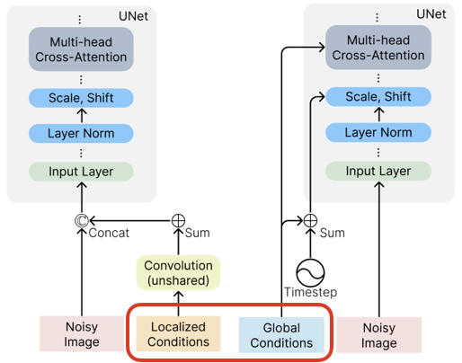

# [Day24] ControlNet，控制狂人？

Author: Nick Zhuang
Type: AI & Data

## 提要

- [前言](#前言)
- [什麼是ControlNet](#什麼是controlnet)
- [ControlNet的演算法](#controlnet演算法)
- [ControlNet的特色](#controlnet的特色)
- [同場加映](#同場加映)

## 前言

昨天我們已經安裝 ControlNet 的插件至 SD，今天就來介紹 ControlNet 原理相關的內容，ControlNet 是一個文生圖的擴充組件，可以調整 SD 輸出的結果，本日內容包含：什麼是ControlNet、ControlNet的演算法、及ControlNet的特色。

## 什麼是ControlNet

ControlNet 是一個不用透過重新訓練 SD 模型就能做到客製化文生圖的一種方法，如下圖。

可以看到兩種模式的範例生成，一種是提供類似草圖作為輸入，並生成不同風格的圖像，生成的風格由ControlNet控制，也就是所謂的 Canny 模式，另一種以姿勢作為輸入，並以此作為依據去生成符合輸入風格的圖像，可以看到輸出的人都有保持相同的姿勢，這就是 Human pose 模式。

在進行 ControlNet 的概念驗證前有先做過幾類的相關研究：

1. HyperNetwork：以一或多個模組網路作為原始網路的插件，它不會去改動到原來的 SD 模型，這個內容前面有講過，具體可以參考[「Day20」HyperNetwork](https://ithelp.ithome.com.tw/articles/10334853)。
2. LoRA：類似於 HyperNetwork 的手法，相似於 Fine Tuning 的方式，但差別是一個是加入模組方式作為嵌入，一個是透過修改層與層之間的權重去達到相同的效果，具體可以參考[「Day19」LoRA](https://ithelp.ithome.com.tw/articles/10334298)。
3. Adapter：這個前面有提過，還記得 Embedding 嗎？作為一個 Textual Inversion 作為詞嵌入的輸入，這個方法也用於 CLIP 的技術當中，這個作法是以預訓練的模型透過加入新的嵌入模組層去達到適應新環境要解決問題的效果，具體可以參考[「Day17」Embedding](https://ithelp.ithome.com.tw/articles/10333017)。
4. Additive Learning：額外學習的方式是夠過凍結預訓練的模型，對其做 linear probe，透過添加新參數的手法；例如，權重遮罩或剪枝、注意力模組等，避免遺忘既有知識問題。
5. Zero Initialized Layers：零初始化層，這個是透過添加1x1的卷積增加網路的空間複雜度，但不影響到既有模型權重，也是 ControlNet 使用的手法之一。

## ControlNet的演算法

左圖代表原始的網路架構，右圖代表新加入的 ControlNet 架構，它將零卷積加入到其中，以初始化權重。

ControlNet 在 SD 的基礎上，將 SD 中的層凍結( Frozen )，並且添加一個可學習的分支，這個分支就是一個 Condition，並在 Condition 的起始位置和結束位置都增加零卷積，保證訓練的穩定性，並且 Condition 的特徵會疊加回 SD 的解碼器特徵上，以達成控制生成的效果。

## ControlNet的特色

ControlNet 提供了文生圖客製化的新方法，可以不用重新訓練 SD 模型，讓高度客製化變得可能，無論是姿勢、紋理、框架等方面都能達到不錯的效果，搭配 LoRA 使用可以有更精細的效果，這也是現在使用 SD 的標準方式了。

## 同場加映

- T2I-Adaptor

這是基於前面提過的 Adaptor 的改良版本，與 ControlNet 不同的是，它可以以多個 Condition 作為輸入，這些 Condition 可以是不同類型。
另外，T2I-Adaptor 是透過 SD 的編碼器 ( Encoder )把 Condition 輸入進去，而 ControlNet 是透過 SD 的解碼器 ( Decoder ) 輸入 Condition。
這個編碼器與解碼器的架構就是 SD 當中的 U-Net。

- Composer

這個作法也與 ControlNet 及 T2I-Adaptor 類似，主要的概念是它將輸入分別 Global 和 Local，Global 負責將特徵輸入到 SD 當中的 U-Net 層及多注意力模組，Local 則是雜訊的圖片，雙管齊下去調整生成圖片的風格，簡言之，就是它將需要生成的特徵作抽離，逐步輸入像是色彩、紋理、乃至框架，以達成控制生成的效果，參考下圖。

## 小結

今天我們介紹了關於 ControlNet 及其他相關的內容；例如，什麼是ControlNet、ControlNet的演算法、ControlNet的特色、T2I Adaptor、及Composer，明天會介紹 SwinIR 的內容，明天見！

## 參考連結

- [Adding Conditional Control to Text-to-Image Diffusion Models](https://arxiv.org/pdf/2302.05543.pdf)
- [不得不讀 | 深入淺出ControlNet，一種可控生成的AIGC繪畫生成演算法！](https://blog.csdn.net/lgzlgz3102/article/details/129774897)
- [AIGC—可編輯的影像生成](https://zhuanlan.zhihu.com/p/609525165)
- [T2I-Adapter: Learning Adapters to Dig out More Controllable Ability for Text-to-Image Diffusion Models](https://arxiv.org/pdf/2302.08453.pdf)
- [Composer: Creative and Controllable Image Synthesis with Composable Conditions](https://arxiv.org/pdf/2302.09778.pdf)
