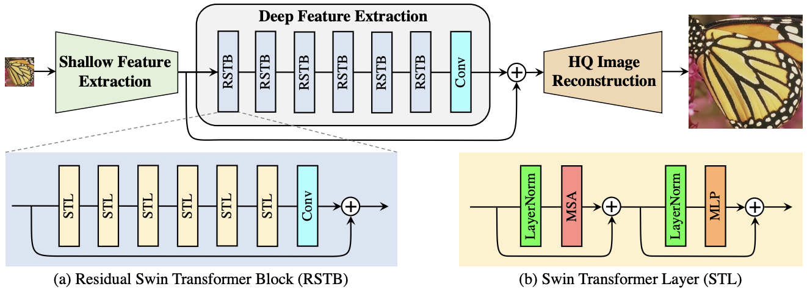

# [Day25] SwinIR，圖像重建的突破

Author: Nick Zhuang
Type: AI & Data

## 提要

- [前言](#前言)
- [什麼是SwinIR](#什麼是swinir)
- [SwinIR的演算法](#swinir的演算法)
- [SwinIR的特色](#swinir的特色)

## 前言

今天我們介紹 SwinIR 相關的內容，SwinIR是一個用於影像重建的方法，本日內容包含：什麼是SwinIR、SwinIR的演算法、及SwinIR的特色。

## 什麼是SwinIR

SwinIR 是基於 Swin Transformer 架構的重建演算法，不同於以往的做法，是透過結合卷積神經網路 ( Convolution Neural Network, CNN )，加上 Transformer 的方式，就能以少量參數的方式，達成原本相當的效果。Swin Transformer 是基於 Vit ( Vision Transformer ) 的改良版本，主要改進了運算方式，降低了參數量，其作法是透過切割卷積，降低了萃取特徵的範圍，並透過滑窗 ( Slide Windows ) 對同個卷積構建相對關係，另外也構建了局部注意力機制 ( Local Attention )，避免原始 Transformer 過於關注全局特徵而忽略了局部細節。

## SwinIR的演算法

先上架構圖，如下所示。

主要分為三個模組，分別是：淺層特徵提取、深度特徵提取、及影像重建的模組。

- 淺層特徵提取：負責初階特徵的提取，透過卷積層的組合模組去萃取圖像中的特徵，用到的是一個 3x3 的卷積。
- 深層特徵提取：進而提取圖像中的特徵，透過殘差塊 ( Residual Block ) 達成，其中包含了 Swin Transformer  Layer ( STL ) 及 3x3 的卷積層 ( Convolution Layer )，其中 STL 包含了 正規化層、MSA ( Muti-Head Self Attention )、MLP ( Mutil-Layer Perceptron )、及殘差的結構，這裡將卷積層放在最後是為了將卷積運算的歸納偏移帶入基於 Transformer 的網路中，為後期淺層和深層特徵的聚合打下更好的基礎。
- 影像重建：可以注意到從淺層特徵到深層特徵中間也有殘差架構，這是為了將淺層特徵能直接傳遞到重建模組上，這裡的模組會將淺層特徵與深層特徵作聚合，並以此作為依據重建影像，訓練的時候會以優化重建損失作為判斷依據，進而增強整體網路影像重建的能力。

## SwinIR的特色

SwinIR 以淺層特徵提取、深度特徵提取、及高解析度重建的模組為基底，融合了卷積神經網路及Transformer兩者的優點，可以透過以少量參數的方式，達成高解析度圖像修復的效果，相較於以往像是LR、ESRGAN、Real-ESRGAN等方法，表現都更為突出，將架構分為淺層及深層提取的方式可以滿足各種範圍特徵提取的需求，並在其中引入了殘差架構，可以讓特徵更好的傳遞到影像重建的模組上。

## 小結

今天我們介紹了關於 SwinIR 的內容；例如，什麼是SwinIR、SwinIR的演算法、及SwinIR的特色，明天會介紹 SD 進階的使用方法，明天見！

## 參考連結

- [SwinIR: Image Restoration Using Swin Transformer](https://arxiv.org/pdf/2108.10257.pdf)
- [圖片超解析度：SwinIR學習筆記](https://zhuanlan.zhihu.com/p/558789076)
- [超分演算法 SwinIR: Image Restoration Using Swin Transformer](https://blog.csdn.net/qq_45122568/article/details/124685158)
- [Hierarchical Vision Transformer using Shifted Windows](https://arxiv.org/abs/2103.14030)
- [Swin Transformer對CNN的降維打擊](https://zhuanlan.zhihu.com/p/360513527)
