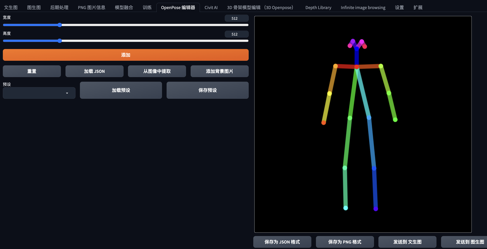
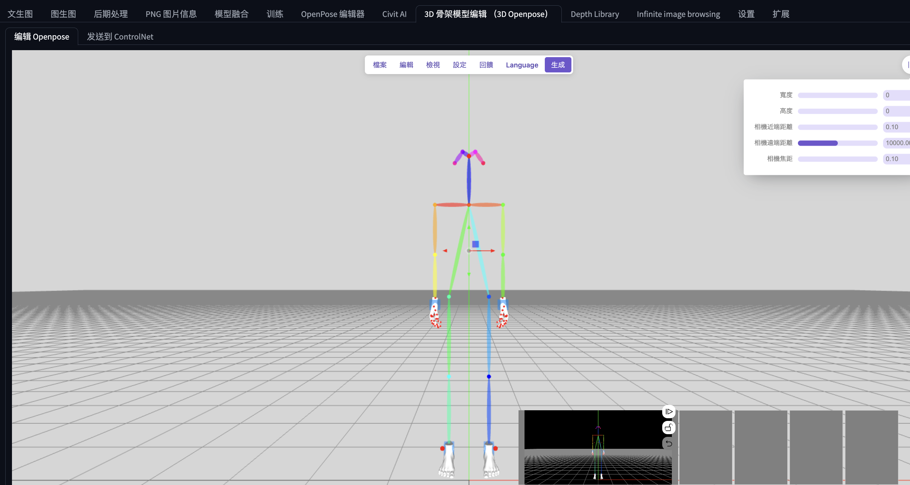
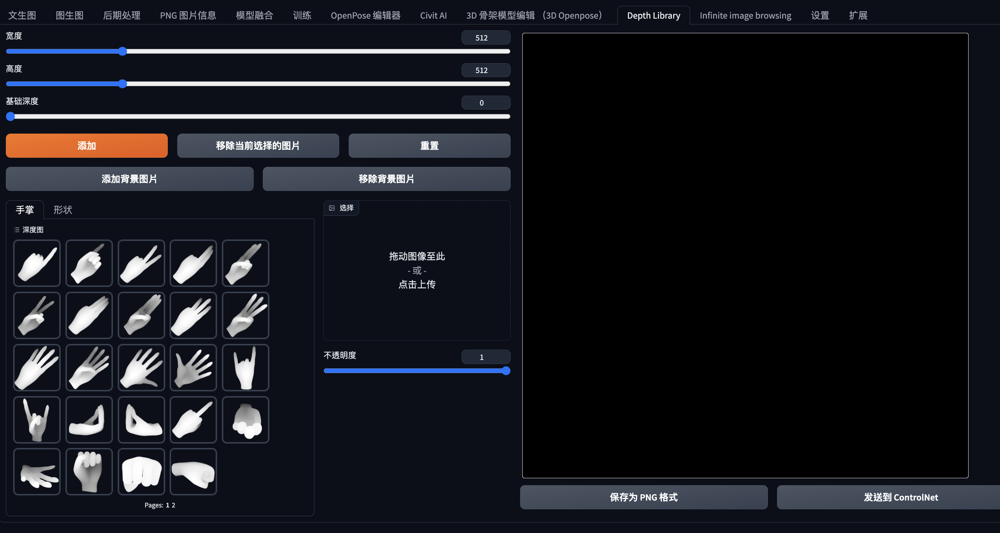
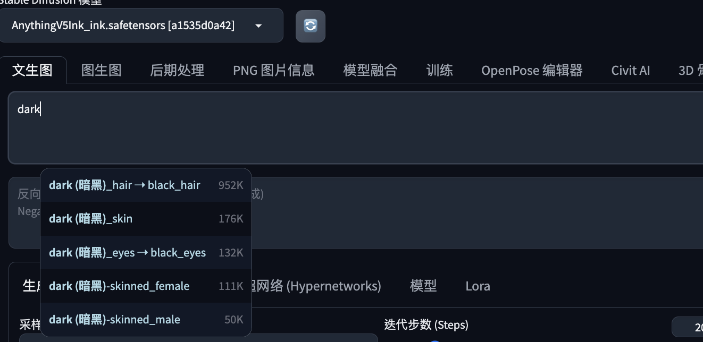
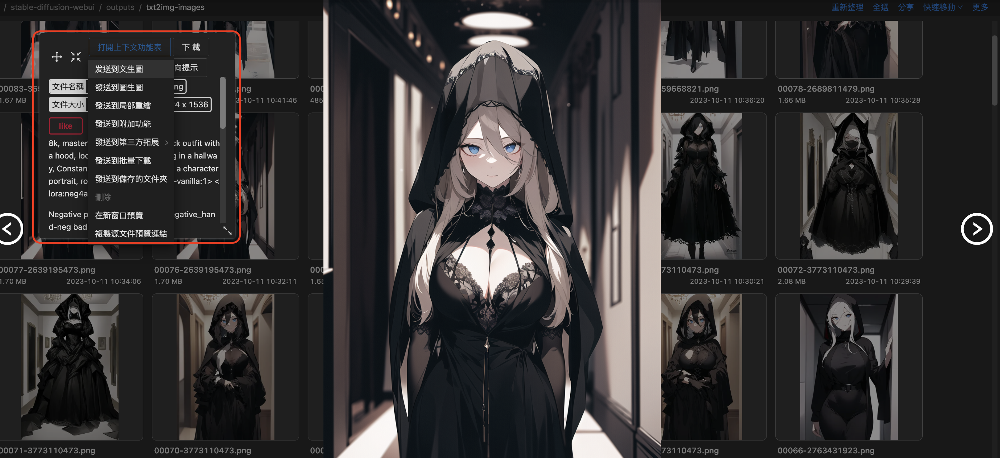

# [Day26] SD的進階使用技巧

Author: Nick Zhuang
Type: AI & Data

## 提要

- [前言](#前言)
- [套件匯總](#套件匯總)
- [安裝](#安裝)
- [使用方式](#使用方式)

## 前言

今天我們介紹 SD 的進階使用技巧，本日內容包含：套件匯總、安裝、及使用方式。

## 套件匯總

先將重點套件做個介紹：

- [Openpose editor](https://github.com/fkunn1326/openpose-editor.git)：這是編輯ControlNet姿勢用的插件，2D。
- [3D Openpose editor](https://github.com/nonnonstop/sd-webui-3d-open-pose-editor.git)：這是編輯ControlNet姿勢用的插件，3D。
- [Depth Library](https://github.com/jexom/sd-webui-depth-lib.git)：這是控制手勢相關的，可以看作姿勢底下細微的調整使用。
- [Tag Complete](https://github.com/DominikDoom/a1111-sd-webui-tagcomplete)：提示詞補全。
- [LLuL](https://github.com/hnmr293/sd-webui-llul)：提升局部繪圖細節。
- [動態CFG](https://github.com/mcmonkeyprojects/sd-dynamic-thresholding)：讓CFG設定可以動態，避免直接調太高生圖異常。

## 安裝

複製對應的URL安裝即可：

```
Openpose editor：https://github.com/fkunn1326/openpose-editor.git
3D Openpose editor：https://github.com/nonnonstop/sd-webui-3d-open-pose-editor.git
Depth Library：https://github.com/jexom/sd-webui-depth-lib.git
Tag Complete：https://github.com/DominikDoom/a1111-sd-webui-tagcomplete
LLuL：https://github.com/hnmr293/sd-webui-llul
動態CFG：https://github.com/mcmonkeyprojects/sd-dynamic-thresholding
```

## 使用方式

我們將技巧設定權結合起來，先看下安裝完的結果：

Open Pose：



3D Open Pose：



Depth Library：



Tag Complete：



最後將技巧合併一起，能生成高品質二次元圖：


使用的Prompt：

```
8k, masterpiece,a woman in a black outfit with a hood, looking at viewer, standing in a hallway, Constance Copeman, darkness, a character portrait, rococo <lora:neg4all_bdsqlsz_V3.5:1>
Negative prompt: easynegative
Steps: 30, Sampler: DPM++ 2M Karras, CFG scale: 11, Seed: 3773110473, Size: 512x768, Model hash: a1535d0a42, Model: AnythingV5Ink_ink, Denoising strength: 0.7, ADetailer model: face_yolov8n.pt, ADetailer confidence: 0.3, ADetailer dilate/erode: 4, ADetailer mask blur: 4, ADetailer denoising strength: 0.4, ADetailer inpaint only masked: True, ADetailer inpaint padding: 32, ADetailer version: 23.9.3, ControlNet 0: "Module: none, Model: None, Weight: 1, Resize Mode: Crop and Resize, Low Vram: False, Guidance Start: 0, Guidance End: 1, Pixel Perfect: False, Control Mode: Balanced", LLuL Enabled: True, LLuL Multiply: 2, LLuL Weight: 0.15, LLuL Layers: ['OUT'], LLuL Apply to: ['out'], LLuL Start steps: 5, LLuL Max steps: 30, LLuL Upscaler: bilinear, LLuL Downscaler: bilinear, LLuL Interpolation: lerp, LLuL x: 128, LLuL y: 192, Hires upscale: 2, Hires upscaler: Latent, Lora hashes: "neg4all_bdsqlsz_V3.5: b1b5db66e2f6", TI hashes: "easynegative: c74b4e810b03", Version: v1.6.0
```

生圖的時候，可以搭配 Image Browsing 使用，有隨機到好的圖片，可以從中將其直接把prompt傳到文生圖修改，如下圖：



## 小結

今天我們介紹了關於進階使用 SD 的內容；例如，套件匯總、安裝、及使用方式，明天會介紹訓練 CKPT 的方式，明天見！

## 參考連結

- [SD基礎插件](https://www.uisdc.com/stable-diffusion-webui-2)
- [SD好用插件](https://www.dun.tax/2023/04/stable-diffusion.html)
