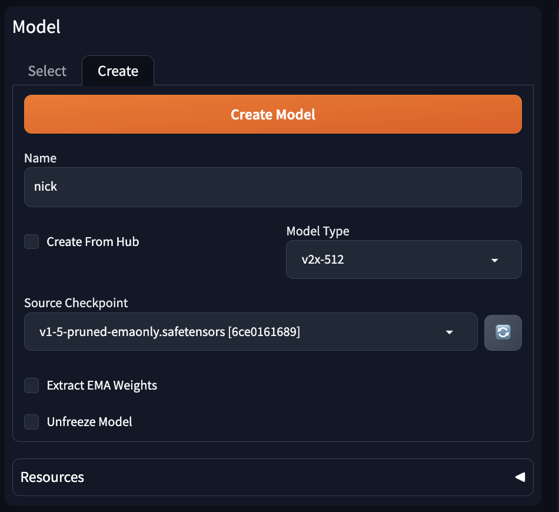
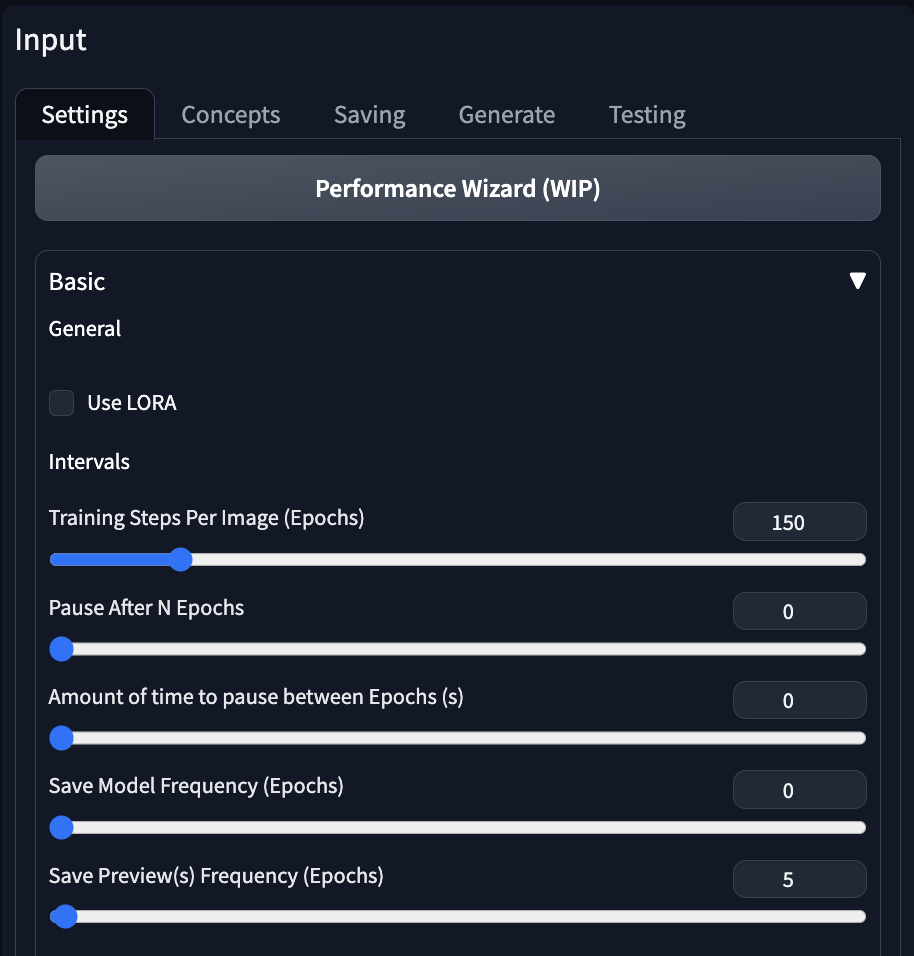
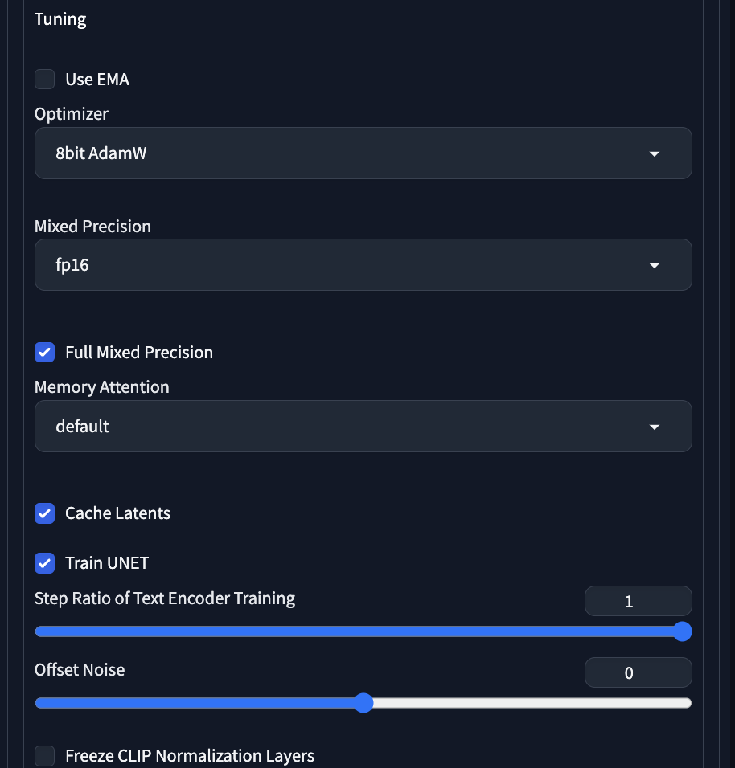
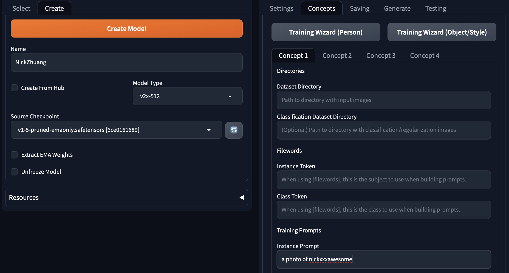
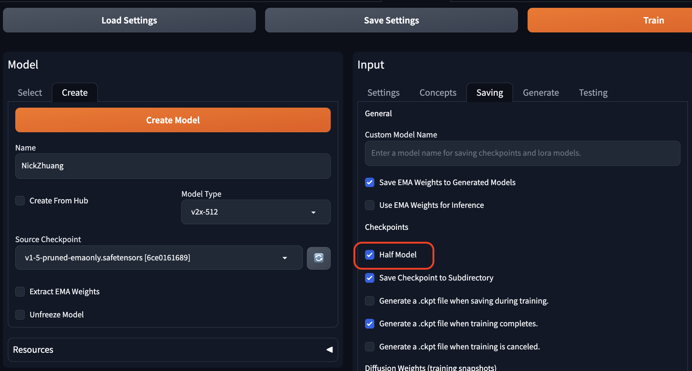
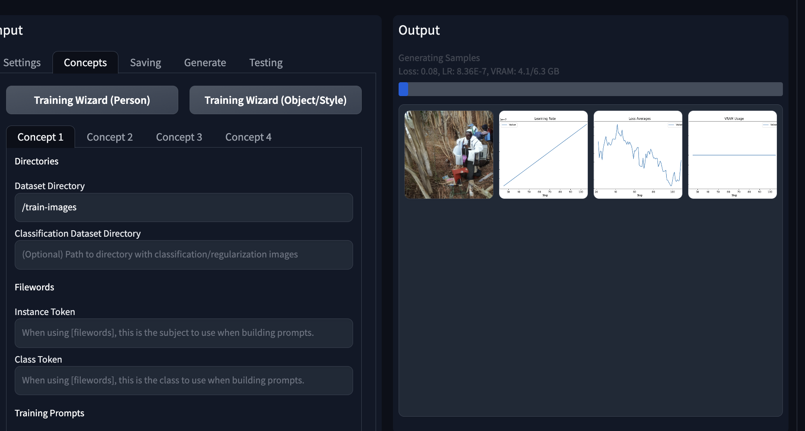

# [Day27] SD訓練Checkpoint

Author: Nick Zhuang
Type: AI & Data

## 提要

- [前言](#前言)
- [訓練方法介紹](#訓練方法介紹)
- [訓練Checkpoint](#訓練checkpoint)

## 前言

今天我們介紹SD訓練Checkpoint相關的內容，本日內容包含：訓練方法介紹、及訓練Checkpoint。

## 訓練方法介紹

基本上，目前實測上常見的方法都可以在 Hugging Face 上面找到，不過它提供的都是下指令的方式，比較適合專業玩家，全部連結如下所示。

* [Unconditional Training](https://huggingface.co/docs/diffusers/training/unconditional_training)
* [Text-to-Image Training](https://huggingface.co/docs/diffusers/training/text2image)
* [Text Inversion](https://huggingface.co/docs/diffusers/training/text_inversion)
* [Dreambooth](https://huggingface.co/docs/diffusers/training/dreambooth)
* [LoRA Support](https://huggingface.co/docs/diffusers/training/lora)
* [ControlNet](https://huggingface.co/docs/diffusers/training/controlnet)
* [InstructPix2Pix](https://huggingface.co/docs/diffusers/training/instructpix2pix)
* [Custom Diffusion](https://huggingface.co/docs/diffusers/training/custom_diffusion)
* [T2I-Adapters](https://huggingface.co/docs/diffusers/training/t2i_adapters)

Unconditional Training 及 Text-to-Image Training，可以理解為圖生圖及文生圖的模型，Textual Inversion 就是詞嵌入 ( word embedding ) ，是關於模型的微調的技術，我們在[「Day17」](https://ithelp.ithome.com.tw/articles/10333017)有探討過相關的內容，DreamBooth 的內容在[「Day18」](https://ithelp.ithome.com.tw/articles/10333641)有討論過，LoRA 的內容則是[「Day19」](https://ithelp.ithome.com.tw/articles/10334298)，ControlNet及 T2I-Adaptor 是[「Day24」](https://ithelp.ithome.com.tw/articles/10337248)，InstructPix2Pix 由於前面沒介紹到，這邊補充一下，這個方法是一種不需要微調模型的一種在擴散階段編輯圖像的一種方法，我們可以將其理解為在生圖階段動態去調整內容，所以不同與前面介紹過的詞嵌入或微調的方法，具體作法是透過一個大型語言模型；例如，GPT-3，加上文字到圖像的模型，以這兩者組合的圖像編輯預訓練數據集進行訓練，就能訓練出具備語言和圖像互補知識的條件擴散模型，可以比較下 CLIP 的內容[「Day12」](https://ithelp.ithome.com.tw/articles/10329538)，CLIP 的內容也與 Custom Diffusion 是相關的，歡迎大家回去複習。

## 訓練Checkpoint

以下介紹一種訓練 Checkpoint 的方式，我們將細部講解 DreamBooth 插件操作的內容。

透過 URL 安裝完插件後，切換到該介面上。

要決定 Name ，這是模型的名稱，Model Type v2x-512，稍後要準備約10張左右的 512 x 512 圖片供訓練使用，Source Checkpoint 就選預設模型即可。

Input 將 Training Steps Per Image 調整成150，Save Model Frequency 調整為0。

Optimizer 選 8bit AdamW，Mixed Precision 選 fp16，Memory Attention 可以的話選 xformers。

Setting那分頁到這邊就結束了，可以存檔一下。

這裡的 Dataset Directory 要填10張圖片所在的目錄，Instance Prompt 可以看到筆者這邊輸入為：a photo of nickxxxawesome，注意到 nickxxxawesome是要找一個唯一的 token 供模型辨識所用。

Half Model 可以減少模型大小，表現也不會差很多，可以試試看。

到這裡就是訓練階段了，以GTX 4090訓練約15分鐘內可以完成，就微調模型來說還蠻快的，完成後只要到文生圖介面，載入你訓練的 Checkpoint ，並輸入關鍵字 nickxxxawesome，就會出現~~我的照片~~。

介紹到這就結束了，若有問題可以到 DreamBooth 的 Github 找尋解答，或是開 issue 諮詢作者，另一種訓練 Checkpoint 的方式可以參考 kohya_ss 的方式。

## 小結

今天我們介紹了關於SD訓練Checkpoint的內容；例如，訓練方法介紹、及訓練Checkpoint，明天會介紹訓練 LoRA 的方法，明天見！

## 參考連結

- [Hugging Face Training](https://huggingface.co/docs/diffusers/training)
- [InstructPix2Pix: Learning to Follow Image Editing Instructions](https://arxiv.org/pdf/2211.09800.pdf)
- [How to train DreamBooth](https://www.youtube.com/watch?v=tuSlUqmlZuc)
- [kohya: 訓練模型神器](https://github.com/bmaltais/kohya_ss?ref=blog.hinablue.me)
