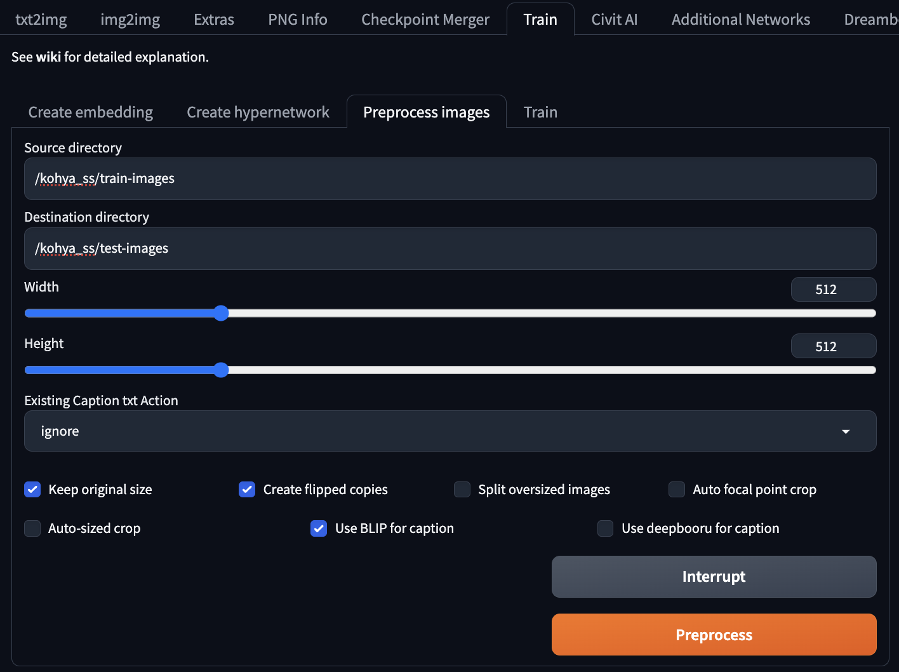

# [Day28] SD訓練LoRA

Author: Nick Zhuang
Type: AI & Data

## 提要

- [前言](#前言)
- [訓練LoRA途徑](#訓練lora途徑)
- [LoRA的訓練](#lora的訓練)

## 前言

今天我們介紹 LoRA 訓練相關的內容，LoRA 是一種微調模型的方式，我們將學習訓練 LoRA 的方法，本日內容包含：訓練LoRA方法、及LoRA的訓練。

## 訓練LoRA途徑

由於 Stable Diffusion 本身的使用者介面 ( User Interface, UI ) 並沒有提供相關的功能，以目前常見的方法來說，有兩種方式可以達到：

1. Kohya SS（選我！我最簡單！）
2. 自己寫 Python 訓練以 Pytorch 為基底的模型（想挑戰的歡迎光臨）

有鑑於此，我們必須借助 Kohya_ss 的介面操作，進而訓練出我們想用的 LoRA。
以下介紹如何安裝：

登入到測試機操作，筆者以 Linux based 主機示範。

```
sudo docker run --gpus 1 -p 8180:8180 --name trainLoRA -it nvcr.io/nvidia/cuda:11.8.0-devel-ubuntu22.04 bash
```

意味著啟動一個container並用於kohya ss的安裝。

以下皆在 container 內操作。

```
apt update
apt install python3-venv
apt install python3-pip
apt install git
git clone https://github.com/bmaltais/kohya_ss.git
cd kohya_ss
apt install python3-tk
```

安裝python tk的時候要設置時區：


選 6 和 73，接著往下。

```
cp /usr/bin/python3 /usr/bin/python
chmod +x setup.sh
./setup.sh
```

這個時候會要等比較久，因為在安裝 Pytorch 及相關套件，通常 AI Framework 的檔案都比較大，動輒5,6G起跳，請耐心等候。
另外安裝的時候，因為預設不是 verbose 模式，所以不會有太多命令行的輸出，實乃正常現象，不用緊張。


最後輸入以下指令啟動，這會開啟在本地的：

```
./gui.sh --server_port 8180 --listen 0.0.0.0 --headless
```


## LoRA的訓練

啟動後，介面如下圖。


可以注意到它的介面與 Stable Diffusion UI 類似，都是用 Gradio 相關套件去開發的。這個工具也可以訓練其他種類的網路，像是[「Day27」](https://ithelp.ithome.com.tw/articles/10338756)的 DreamBooth。

回到 Stable Diffusion WebUI ，需要安裝 additional networks 的插件。


安裝好後重啟UI，接著進到 Train -> Preprocess images。



設定 directory 的位置、及勾選對應選項，點擊 Preprocess，好了會顯示 Preprocessing finished。


可以看到每張圖片有多出對應的 txt 檔案。

回到 kohya ss UI，到 LoRA -> Training。


設定路徑及模型名稱，模型名稱不能空格，用下滑線連接。

Prameters 的 Training Batch Size 及 Epoch 都調2，怕顯存不夠都調1即可。

Network Rank (Dimension) 及 Network Alpha 都調 128，這樣的 LoRA 生成效果會更細緻，不過檔案也更大。

好了點擊 Training 即可，這要一點時間，後面就是看 LoRA 效果反覆調適的過程，祝大家好運！

## 小結

今天我們介紹了關於 LoRA 訓練相關的內容；例如，訓練LoRA途徑、及LoRA的訓練，明天會介紹SD XL的內容，明天見！

## 參考連結

- [Hugging Face Training](https://huggingface.co/docs/diffusers/training)
- [訓練LoRA教學](https://www.youtube.com/watch?v=s0XJOGfUxkE)
- [kohya: 訓練模型神器](https://github.com/bmaltais/kohya_ss?ref=blog.hinablue.me)
