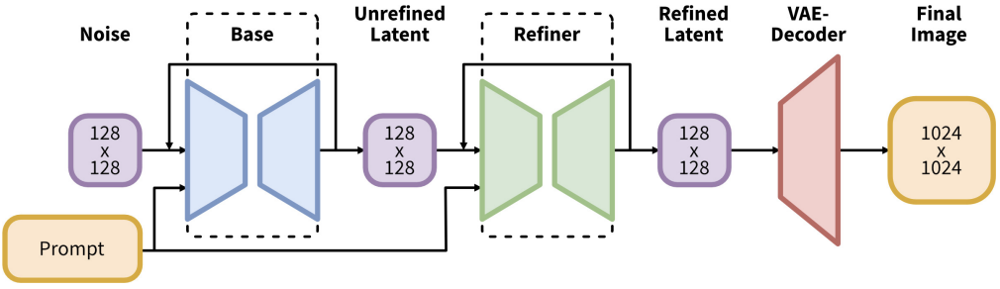

# [Day29] SD XL：SD的限界突破

Author: Nick Zhuang
Type: AI & Data

## 提要

- [前言](#前言)
- [什麼是SD XL](#什麼是sd-xl)
- [SD XL的演算法](#sd-xl的演算法)
- [SD XL的特色](#sd-xl的特色)

## 前言

今天我們介紹 SD XL 相關的內容，SD XL 是基於 SD 改良的模型，使用到了更大的網路架構，本日內容包含：什麼是SD XL、SD XL的演算法、及SD XL的特色。

## 什麼是SD XL

SD XL 是以 SD 架構做為基礎改良的模型，主要改進三個方面：

1. 加大其中的 U-Net 架構，調整成3倍，以更多注意力模塊 ( attention block ) 與更大的交叉注意力上下文 ( cross attention context ) 達成，這樣可以讓 U-Net 學習到更多的特徵，將有助於生成更細緻的圖像。
2. Conditioning 相關的優化，這是針對 SD 模型中 Conditioning Mechanisms 所做的改進，包含：基於模型在圖像尺寸、基於模型在裁減參數等等的改進，這是為了要讓模型可以不被圖像尺寸限制及減少運算量。
3. 引入了一個獨立的基於擴散的模型，能夠提高生成圖像的品質與解析度。

## SD XL的演算法

先上架構圖，如下圖所示。

這裡的方法是以 128x128 大小的圖片作為潛空間 ( Latent Space ) 的輸入，最後輸出 1024x1024 的圖片，主要分為三個部分：Base、Refiner、VAE-Decoder，其中的 Base 和 Refiner 構成了文生圖的模塊，而 VAE-Decoder 為圖生圖的模塊，兩者相連構成了整體文生圖的模型。

- Base：由 U-Net、VAE、及兩個 CLIP Text Encoder 所構成，這裡的作用與原始 SD 架構中所做的事情相似，本質上就是以 Prompt 及圖像作為輸入去訓練模型，這裡輸出的 Unrefined Latent 代表潛空間的特徵，我們可以理解為圖像。
- Refiner：由 U-Net、VAE、及單個 CLIP Text Encoder 所構成，這裡的作用是將 Base 模塊輸出的圖像進行以圖生圖，它會將輸入的圖像去除小雜訊及提升圖像的細緻度，Base 結合 Refiner 的做法是一種模型融合的方法，概念上就是專業分工，這種做法在生成圖像領域上，能夠大幅提升其能力。
- VAE-Decoder：由 VAE 的 Decoder 所構成，這裡的作用是將 Refiner 輸出的圖像進行以圖生圖，它會改良輸入圖像中關鍵的潛特徵；例如，細節資訊、小物件的特徵、及整體色彩。

## SD XL的特色

原始的 SD 模型參數量約為10億左右，而 SD XL 模型的參數量則達到了66億，雖然如此，但 SD XL 在生圖的時間上，只多出了 SD 約20~30%左右，相當不簡單，更不用說它生成圖像的品質在基準上，相較於 SD 更好，它也很好的借鏡了模型融合的技術，使得生圖的質量上有相當程度的飛躍，並具備了適應遷移學習的能力，筆者相信在 AIGC 圖像相關的領域後續會越來越好。

## 小結

今天我們介紹了關於 SD XL 的內容；例如，什麼是SD XL、SD XL的演算法、及SD XL的特色，明天會總結30天以來介紹的內容，明天見！

## 參考連結

- [SDXL: Improving Latent Diffusion Models for High-Resolution Image Synthesis](https://arxiv.org/pdf/2307.01952.pdf)
- [深入淺出完整解析Stable Diffusion XL（SDXL）核心基礎知識-知乎](https://zhuanlan.zhihu.com/p/643420260)
- [Introduction to Stable Diffusion XL 0.9](https://ngwaifoong92.medium.com/introduction-to-stable-diffusion-xl-0-9-b7b5bbc8e0e8)
