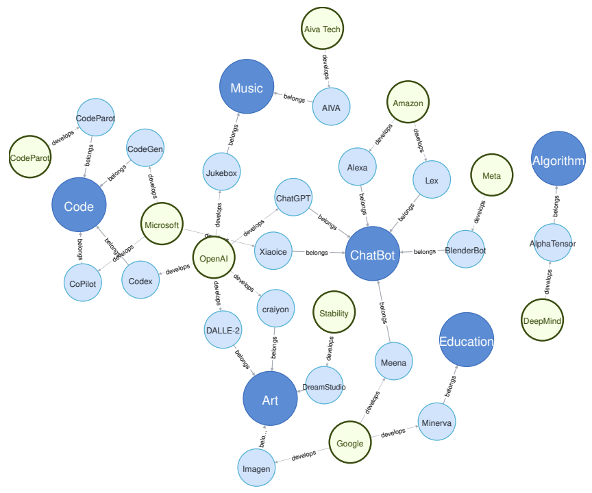
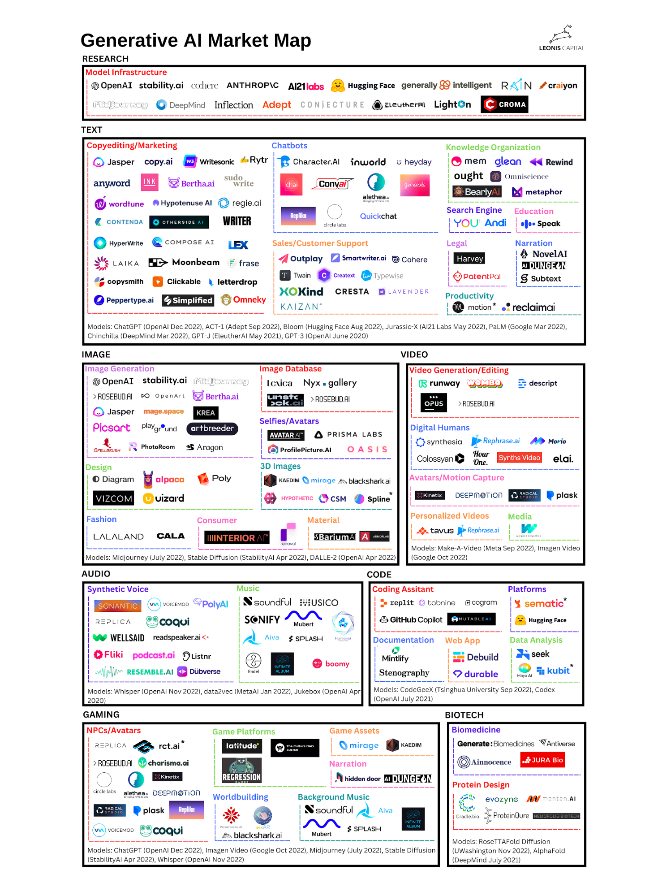

# [Day3] AIGC的特色與應用

Author: Nick Zhuang
Type: AI & Data

## 提要

- [前言](#前言)
- [AIGC的特色](#aigc的特色)
- [AIGC的應用](#aigc的應用)
- [AIGC的生態系](#aigc的生態系)

## 前言

今天我們會從 AIGC ( AI Generated Content ) 的定義去延伸，思考關於特色及應用的議題，原則上因為 AIGC 承襲了 LLM ( Large Language Model ) 的架構，因此我們可以從此處去著手探討相關的內容。
這邊先提到特色及應用，是為了能讓我們先知道了解這些東西能做什麼，也幫助後面學習的時候可以針對自己想了解的部分進一步加強，這是構建學習地圖的一部份策略。

## AIGC的特色

AIGC 的特色，來看看 ChatGPT 怎麼說：

```
AI Generated Content（AI生成內容）確實是一個重要的概念，以下是有關AI生成內容的特色：

自動生成： AI生成內容利用機器學習和自然語言處理技術，能夠自動生成文章、文字、圖片、音頻等各種形式的內容，從而節省了人工創作的時間和成本。

大規模生產： AI生成內容可以在短時間內生成大量內容，從而適應了現代信息爆炸的需求，例如新聞稿、商品描述、社交媒體帖子等。

個性化定制： 通過設定不同的參數和條件，AI生成內容可以根據用戶的需求和偏好生成個性化的內容，從而提供更有價值的使用者體驗。

多媒體生成： 除了文字，AI生成內容也能夠生成圖片、音頻和視頻等多種媒體形式的內容，從而實現更豐富的傳播效果。

跨領域應用： AI生成內容不僅限於文字領域，還在藝術、設計、廣告等多個領域展示出巨大潛力，能夠創造出驚人的創意和作品。

人機合作： 雖然AI能夠生成內容，但人類的創造力和審美判斷仍然是不可或缺的。因此，AI生成內容通常是在人機合作的基礎上實現最佳效果。

總之，AI生成內容是一項革命性的技術，具有自動生成、大規模生產、個性化定制等特點，將對內容創作、傳播和多個領域帶來深遠的影響。
```

小結一下，它主要的意思基本上就是：

1. AIGC 的特色，可以歸納為六類；例如，自動生成、規模化、個性化、支援多媒體、跨領域、及人機合一。
2. 簡單歸納後，特點為：自動生成、大規模生產、個性化定制等。

我們將其以文獻探討方式擴充一下，將特色區分為優點、及缺點，並以表格作為呈現：

| 優點           | 描述                                                                                                                    |
| -------------- | ----------------------------------------------------------------------------------------------------------------------- |
| 效率及可拓展性 | AIGC 可以提供比傳統人類書寫更多的好處；例如，速度、及語言本地化。另一個好處是它能夠為各種網站創建個人化的社交媒體帖子。 |
| 搜尋引擎的優化 | AI 可以分析網站上的內容並給出 SEO 優化的建議。                                                                          |
| 有助於科學研究 | AI 可以通過機器學習的演算法去協助分析大型數據集，以識別人類可能不容易看到的模式和相關性。                               |
| 克服作家的障礙 | AI 工具可以創建詳細的大綱和要點，去幫助作家決定哪些內容應被包含在文章中。                                               |

| 缺點           | 描述                                                                                           |
| -------------- | ---------------------------------------------------------------------------------------------- |
| 道德感及可信度 | 由於缺乏預期的語氣和個性，生成的答案可能會被過濾掉                                             |
| 加速社會失衡   | 有些人可以使用 AI 工具以不同的速度完成原始任務，而另一些人可能需要花費大量時間思考和創建內容。 |
| 教育的負面影響 | AIGC 可能缺乏有效學習所需的人性和個人化                                                        |
| 同理心不足     | 例如，AI 生成的音樂可能不具有與人類演奏和創作的音樂相同的情感深度和真實性。                    |
| 須人工介入     | 人員仍須介入檢查生成的內容是否符合品質。                                                       |
| 缺乏創造力     | 對 AIGC 來說，生成最新、時下趨勢的觀點及文章是比較困難的。                                     |

OK，到這邊我們已經大致瞭解了關於 AIGC 的優劣勢，下一節要看的是應用環節。

## AIGC的應用

AIGC 的應用目前主要可以分為五個領域，分別是：聊天機器人、藝術、音樂、程式碼、及教育，演算法相關的研究有，但是數量很少，如下圖所示。



聊天機器人方面，目前最常見的就是ChatGPT了，這是OpenAI這家公司的產品。其他的還有微軟的Xiaoice、Google的Meena。

藝術方面，目前常見有幾種主流；例如，MidJourney、Stable Diffusion、及DALLE-2，這些工具可以用作圖像生成。

音樂方面，常見的有 Aiva Tech 的 AIVA、或是OpenAI的Jukebox等等。

程式碼方面，可以使用OpenAI的CodeGPT，這裡有個有趣的延伸議題，大家可以參考MetaGPT的論文，裡面提到如何以簡單提問的方式讓他幫你規劃整個軟體專案，從0到1，如圖所示。


教育方面，Google的Minerva目前有不錯的表現，可以詢問它關於不等式相關的問題；例如，二元一次方程式求解的問題。

理解 AIGC 的整體應用後，我們接續探討生態系的環節。

## AIGC的生態系

這裡直接上圖，描述了2023年初的狀況，市場地圖裡面涵蓋了幾個類別，分別是：研究、文本、圖像、影片、音頻、程式碼、遊戲、及生物科技等等。



可以看到超級多啊哈，但不用緊張，筆者介紹幾個有用過的。

OpenAI的ChatGPT就不用著墨太多了，這很常用，最常用它詢問程式碼問題，偶爾還會嗆它程式碼亂寫XD。

Hugging Face是跟Stable Diffusion相關的，它的網站上面會放Checkpoint或是LoRA的模型以供使用，這部分後面會提到。

GitHub Copilot以前有用過，不過後來幾乎都靠ChatGPT，就比較少在用，另外它上面還有一家tabnine，這是一個可以在VS Code上面安裝的插件，支援自動補全，好用。

總結來說，可以看到非常多的應用項目，應用的範圍與場域都蠻廣的。~~每個種類水池都頗深，所以是歡迎大家一起下水玩耍（？~~

## 小結

本日我們從 AIGC 的特色出發，進而去探討 AIGC 的應用，並以生態系的整體介紹作為總結，明天我們會討論關於 AIGC 的演進，明天見！

## 參考連結

- [AI-Generated Content (AIGC): A Survey](https://arxiv.org/pdf/2304.06632.pdf)
- [A Comprehensive Survey of AI-Generated Content (AIGC):A History of Generative AI from GAN to ChatGPT](https://arxiv.org/pdf/2303.04226.pdf)
- [MetaGPT的介紹與使用](https://github.com/geekan/MetaGPT)
- [AIGC的市場現況](https://www.leoniscap.com/posts/chinas-generative-ai-landscape)
