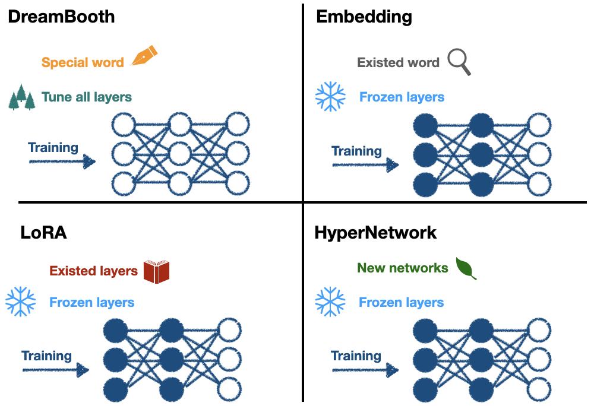

# [Day30] 全文總結：AIGC的前世今生

Author: Nick Zhuang
Type: AI & Data

## 提要

- [前言](#前言)
- [SD理論篇](#sd理論篇)
- [SD應用篇](#sd應用篇)
- [結論](#結論)

## 前言

今天我們會介紹30天以來總結相關的內容，本日內容包含：SD理論篇、SD應用篇、及結論。

## SD理論篇

我們從定義 AIGC ([「Day2」：什麼是AIGC？](https://ithelp.ithome.com.tw/articles/10320308)) 的角度出發，賦予 AIGC 新的定義：AIGC = PGC + UGC，並探討 AIGC 的演進 ([「Day4」：AIGC的演進 ](https://ithelp.ithome.com.tw/articles/10322686))，涵蓋多個圖像生成模型的領域；例如，VAE ([「Day5」：VAE](https://ithelp.ithome.com.tw/articles/10323542))、GAN([「Day6」：GAN](https://ithelp.ithome.com.tw/articles/10324412))、Pixel RNN([「Day7」：Pixel RNN](https://ithelp.ithome.com.tw/articles/10325176))、Flow([「Day8」：Flow](https://ithelp.ithome.com.tw/articles/10325816))、及 Diffusion([「Day9」：Diffusion](https://ithelp.ithome.com.tw/articles/10326874))，在這其中除了 Pixel RNN 以外，都具有雙向逆反的組件，而 Diffusion 中的擴散模型架構，為後的 Stable Diffusion ([「Day14」：Stable Diffusion](https://ithelp.ithome.com.tw/articles/10331008)) 拉開了序幕。

2021年，Dhariwal *et al*. 提出的論文 Diffusion Models Beat GANs on Image Synthesis，指出在圖像生成領域上，Diffusion模型已經超越了GAN的表現。2023年3月，Peebles *et al*. 提出的論文 Scalable Diffusion Models with Transformers，代表已經有人嘗試以 Transformer ([「Day10」：Transformer](https://ithelp.ithome.com.tw/articles/10331008)) 的架構取代 Diffusion Model 中的 U-Net ( Stable Diffusion Model 也是用 U-Net )，嘗試去探索其架構的必要性，之所以在 Diffusion Model 中使用 U-Net 架構的原因是來自於過往研究的經驗；例如，Pixel CNN，當時以這樣的架構就可以有不錯的表現，因此才沿用至今，接著透過 CLIP ([「Day12」：CLIP](https://ithelp.ithome.com.tw/articles/10329538)) 的技術，巧妙地將文與圖的關係建立，將其概念加入到 Stable Diffusion ( Latent Diffusion Model )。

至於 NeRF([「Day11」：NeRF](https://ithelp.ithome.com.tw/articles/10331008))，神經輻射場，算是不同於 ViT ( Vision Transformer ) 的研究方向，它的主軸概念是可以將視點建模，實現了單場域內的任意視點生成，這意味著如果將來算力足夠的情況下，以這樣邏輯生成的圖片可以任意拉近拉遠，旋轉視角也不會有問題，就像看到真的物體一樣，因為它已經將該場域內所有物體都建模，任何視角去看都不會有問題，這種方式比較接近我們人類在真實世界的感覺。

模型微調方面，介紹了 Parameter-Efficient Fine-Tuning (PEFT)，探討了 Pre-Trained Model 的概念，我們已經知道，由於大型模型參數量龐大，要重新訓練會相當耗費時間成本，有鑑於此，有效率的微調模型的手法就相當重要，常見的做法是 Linear probe，透過預訓練模型加上凍結部分不需要訓練的層，只訓練後面的少數的必要層。與 SD 相關的包含：Embedding ([「Day17」：Embedding](https://ithelp.ithome.com.tw/articles/10333017))、DreamBooth ([「Day18」：DreamBooth](https://ithelp.ithome.com.tw/articles/10333641))、LoRA ([「Day19」：LoRA](https://ithelp.ithome.com.tw/articles/10334298))、HyperNetwork ([「Day20」：HyperNetwork](https://ithelp.ithome.com.tw/articles/10334853))。詳細的比較，參考下圖。

DreamBooth 會創造一個新詞作為詞嵌入，會重新訓練所有層；Embedding 會尋找一個既有的詞用作詞嵌入，凍結部分層去做訓練；LoRA 會從 U-Net 特定層加入特定權重，這種架構好比從一本書去加入書籤，書籤就是 LoRA 的內容，我們還會拿筆在加入書籤的地方寫些小筆記，即基於 low rank 的方法，並凍結部分層去做訓練；HyperNetwork 會從 U-Net 的交叉注意力模組中加入特定的網路模塊，並凍結部分層去做訓練。

我們還回顧了其他的 SD 模型控制方法；例如，ControlNet ([「Day24」：ControlNet](https://ithelp.ithome.com.tw/articles/10337248))、T2I-Adaptor、及Composer，這些方法可以生成更加客製化的圖像。並介紹了SwinIR ([「Day25」：SwinIR](https://ithelp.ithome.com.tw/articles/10337713))，這是一種相較於LR、ESRGAN、及Real-ESRGAN而言，更有效率的圖像重建方法。

最後，我們探討了 SD XL([「Day29」：SD XL](https://ithelp.ithome.com.tw/articles/10339667))，一個新穎的 SD 改良架構，雖然增加了6倍左右的網路參數量，但生成時間只有增加20~30％，且可以生成更高品質的圖像。

## SD應用篇

我們從 AIGC 的應用([「Day3」：AIGC Applications](https://ithelp.ithome.com.tw/articles/10321803))出發，以此為基礎介紹了常用的生成圖像工具([「Day13」：GAI Tool](https://ithelp.ithome.com.tw/articles/10330356))；例如，DALLE、Midjourney、及Stable Diffusion，我們實作了 SD 的安裝方法([「Day15」：SD Installation](https://ithelp.ithome.com.tw/articles/10331659))、及 SD 的基本使用方式([「Day16」：SD Basic](https://ithelp.ithome.com.tw/articles/10332396))([「Day21」：Civitai](https://ithelp.ithome.com.tw/articles/10335626))，介紹了常用的插件([「Day22」：SD 基礎插件](https://ithelp.ithome.com.tw/articles/10336116))([「Day23」：SD 進階插件](https://ithelp.ithome.com.tw/articles/10336771))，並將使用技巧整合在一起([「Day26」：SD Advanced](https://ithelp.ithome.com.tw/articles/10338198))，最後以訓練模型的方式作為後續的優化方式([「Day27」：Training Checkpoint](https://ithelp.ithome.com.tw/articles/10338756))([「Day28」：Training LoRA](https://ithelp.ithome.com.tw/articles/10339206))。

## 結論

本系列文以 AIGC 的宏觀視角出發，回顧了過往的 AI 生成圖像架構；例如，VAE、GAN、及 Diffusion，並以 Stable Diffusion 為基準，探索了 GAI 的前世今生，延伸議題方面，筆者建議以下方向：

1. GAN 的演進，關於 SD 工具中使用到的 GAN 種類並未詳細探討。
2. Transformer 的演進，不同種類的注意力機制？使用時機與差異？
3. Parameter-Efficient Fine-Tuning (PEFT) 總共有哪些種類與變體？使用時機為何？
4. LLM 與擴散模型的關聯，談談 LLAVA 的技術與應用。
5. AIGC 的道德議題，Trusty AI 如何做到？

以目前的整體結論來說，我們已經知道，Stable Diffusion 是有潛力的架構，除了有厚實的理論為基底外，開源的工具完整度也已達到相當水準，光以每週更新迭代的速度就可見其熱門的程度，AIGC 的時代已經來臨，也許我們每個人，都能夠期待，那個更好的明天，一個強 AI 普及的世代。

## 致謝

感謝各位邦友及評審們閱讀我的作品，筆者在既有內容上面已盡力補齊相關知識供讀者參考，若有不足之處還請大家多包涵，希望本系列文可以帶給大家一些啟發、讓普羅大眾更容易了解 AIGC 相關的知識，感謝一路幫助我的人，祝大家萬事順心，謝謝大家。

## 參考連結

- [Diffusion Models Beat GANs on Image Synthesis](https://arxiv.org/abs/2105.05233)
- [生成模型之PixelCNN](https://zhuanlan.zhihu.com/p/461693342)
- [Convolutional Networks for Biomedical Image Segmentation](https://arxiv.org/abs/1505.04597)
- [LLaVA: Large Language and Vision Assistant](https://llava-vl.github.io/)
