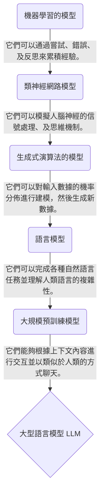
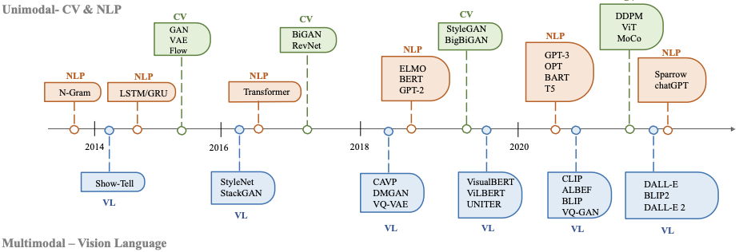

# [Day4] AIGC的演進

Author: Nick Zhuang
Type: AI & Data

## 提要

- [前言](#前言)
- [AI模型的演進](#ai模型的演進)
- [GAI的歷史](#gai的歷史)
- [GAI演算法的演進](#gai演算法的演進)

## 前言

今天我們會從 AIGC ( AI Generated Content ) 的定義去延伸，繼昨天的 AIGC 應用等內容，進而延伸探討關於 AIGC 的演進相關的內容；例如，AI模型的演進、GAI的歷史、及GAI演算法的演進。

## AI模型的演進

我們可以看到：

1. 從早期的機器學習開始，數據是被函式或參數所分門別類，這個演算法旨在以過去經驗去簡單歸納出新的演算法。
2. 類神經網路進而去模擬人腦神經的信號處理、及思維機制。到了生成式演算法後，主要受惠於Transformer，它將人類注意力機制引入模型的架構中，另外還有生成是對抗網路 (Generative Adversarial Network, GAN)，它是後續許多熱門變體及架構的靈感來源。
3. 隨著GAN的架構演進，越來越多的語言模型被開發出來；例如，BERT，它被證實能夠理解人類語言的複雜性。
4. 近期，我們將預訓練的方法套用在語言模型上，避免頻繁改動其參數影響到其整體的表現，以此構建出更具泛化性的語言模型，由於這些模型是透過人類聊天訊息去進行訓練的，所以與其互動的時候，可以表現出類似人類聊天的行爲。
5. 後續，我們可以持續關注這些大型語言模型的表現。

## GAI的歷史

- 文本生成
  文本方面的生成式AI最早可以追朔到1950年左右，當時的主要模型是隱式馬可夫模型(Hidden Markov Models, HMMs)、及高斯混合模型(Gaussian Mixture Models, GMMs)，這些模型可以生成序列資料；例如，語音、及時間序列。到了深度學習(Deep Learning, DL)，在自然語言處理(Natural Language Processing, NLP)中，是使用N-gram的方法對句子進行建模，它能透過單詞分佈去搜索最佳序列，但無法在長句中使用。因此，後來引入了循環神經網路(Recurrent Neural Networks, RNNs)去解決這個問題，並以此作為基底改良，提出了長短期記憶(Long Short-Term Memory, LSTM)、及門控循環單元(Gated Recurrent Unit, GRU)的架構，這些方法可以處理大約200個標記(token)。
- 圖像生成
  圖像方面的生成式AI最早可以追朔到1980年左右，當時主要的演算法是紋理合成、及紋理映射，這樣的方法受限於人工的特徵設計，難以生成複雜多樣的圖像。直到2014年，生成對抗網路(Generative Adversarial Networks, GANs)被提出，在各種領域中都有不錯的表現。與此同時，變分自編碼器(Variational Auto Encoders, VAEs)及其他方法也逐漸被開發出來；例如，基於Flow的模型(Flow-based Model)、及擴散模型(Diffusion Model)，它們對於圖像生成可以有更細緻的操作，進而生成更高解析度的圖像。
- 殊途同歸
  2017年，文本生成的方法後續受惠於Transformer架構的出現，利用其注意力機制可以達到很好的效果，圖像生成自然也不落人後，2019年，透過ViT(Vision Transformer)架構的提出，將Transformer架構與視覺組件結合，用以實現圖像生成，並在2020年提出Swin Transformer，將其圖像生成方法做了改良，以滑窗(slide window)方式，減少原本圖像的運算量，後來，單模態演化成多模態，衍伸出了能同時處理文本和圖像的模型；例如，CLIP，CLIP 是一種聯合視覺語言模型，它將 Transformer 架構與視覺組件相結合，使其能夠接受大量文本和圖像數據的訓練。由於它在預訓練過程中結合了視覺和語言知識，因此它也可以用作多模態提示生成中的圖像編碼器。

## GAI演算法的演進

按照前一節的討論，我們將後續要探討的演算法整理成列表，如下所示。

| 演算法      | 年份 | 描述                                                                                                                                                                                                                         |
| ----------- | ---- | ---------------------------------------------------------------------------------------------------------------------------------------------------------------------------------------------------------------------------- |
| VAE         | 2014 | 基於變分下界約束獲得的編碼器-解碼器模型。                                                                                                                                                                                    |
| GAN         | 2014 | 基於對抗性學習的生成器-判別器模型。                                                                                                                                                                                          |
| Flow-based  | 2015 | 學習非線性雙射變換，將訓練數據映射到另一個空間，其空間分佈可以被因式分解。整個模型架構取決於直接最大化似然(likelihood)對數來實現這一點。                                                                                     |
| Diffusion   | 2015 | 擴散模型有兩個過程。在前向擴散階段，將噪聲逐漸施加到圖像上，直到圖像被完全的高斯噪聲破壞，然後在反向擴散階段，學習從高斯噪聲中恢復原始圖像的過程。訓練後，模型可以使用這些去噪方法從隨機輸入生成新的"乾淨"數據。             |
| Pixel RNN   | 2016 | 基於深度的循環神經網路，它沿著兩個空間維度順序預測圖像中的像素。對原始像素值的離散機率進行建模，並對圖像中完整的依賴關係集進行編碼。                                                                                         |
| Transformer | 2017 | 這種網路模型最初用於完成不同語言之間的文本翻譯任務，基於自注意力機制。主體包括Encoder和Decoder部分，分別負責對源語言文本進行編碼，並將編碼信息轉換為目標語言文本。                                                           |
| Nerf        | 2020 | 它提出了一種方法來優化一組輸入圖像的連續 5D 神經輻射場（任何連續位置處的體積密度和與視圖相關的顏色）的表示。要解決的問題是，給定一組捕獲的圖像，如何從新的視點生成圖像。                                                     |
| CLIP        | 2021 | 首先，進行自然語言理解和電腦視覺分析。其次，使用預先標記的"文本圖像"訓練數據來訓練模型。一方面，根據文本訓練模型。從另一個方面來說，訓練另一個模型，不斷調整兩個模型的內部參數，使模型輸出的文本和圖像特徵值分別匹配和確認。 |

以上是這些與AIGC演算法相關的簡介，我們會在後續詳細做介紹與討論。

## 小結

今天我們回顧了三個面向的歷史演進；例如，AI模型、GAI的文本與圖像、及GAI中的演算法，後續，我們會接續GAI中的演算法做詳細的探討，明天見！

## 參考連結

- [AI-Generated Content (AIGC): A Survey](https://arxiv.org/pdf/2304.06632.pdf)
- [A Comprehensive Survey of AI-Generated Content (AIGC):A History of Generative AI from GAN to ChatGPT](https://arxiv.org/pdf/2303.04226.pdf)
- [Generative models](https://openai.com/research/generative-models)
