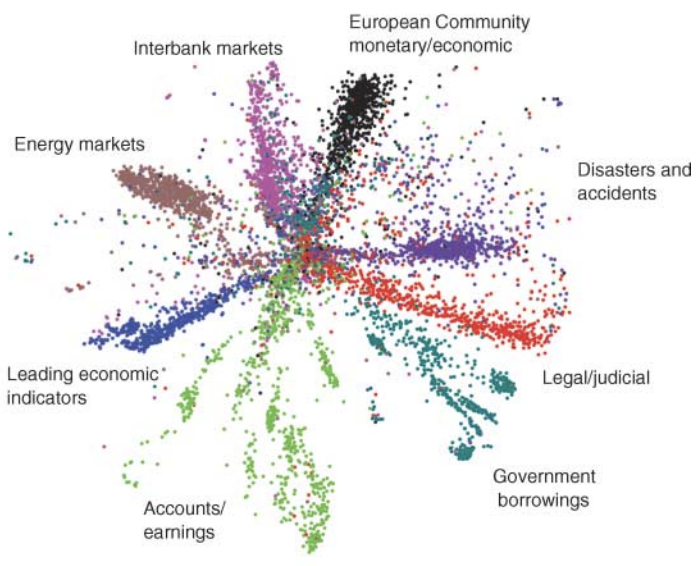
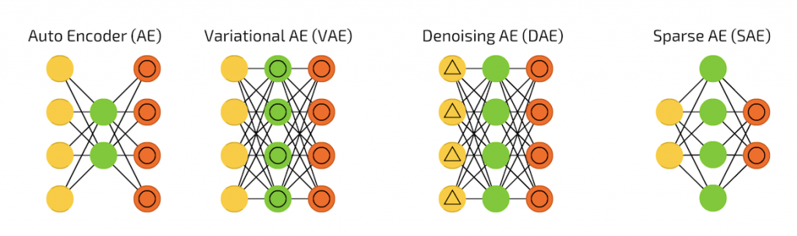
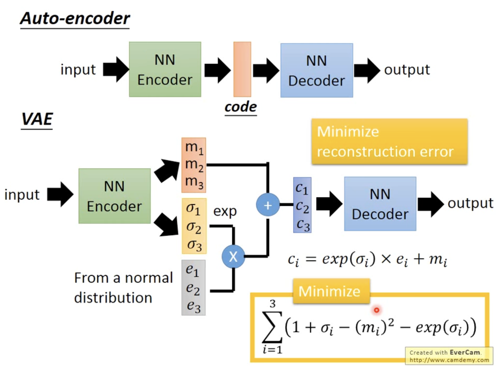

# [Day5] VAE，好久不見

Author: Nick Zhuang
Type: AI & Data

## 提要

- [前言](#前言)
- [AE介紹](#ae介紹)
- [AE種類](#ae種類)
- [VAE介紹](#vae介紹)

## 前言

今天我們介紹什麼是VAE，在這開始之前，我們會先回顧關於AE的內容，先看什麼是自編碼器、及自編碼器有哪些種類等等。

## AE介紹

自編碼器（Autoencoder）是一種常見的無監督學習模型，用於學習數據的壓縮表示和特徵提取。

其中的思想最早來自於2006年的一篇論文，這篇是AI大神之一Hinton寫的，它主要是比較了主成份分析法(principal components analysis, PCA)，PCA是一種將數據降低維度的技術，這樣的好處是可以更容易地分析資料、及做好統計分析的優點，自編碼器的優勢在於它受惠於硬體算力的提升，使得它可以實現，經mnist數據集的實驗表示它的效果相較於PCA來說更好，以下是有關自編碼器的簡要介紹：

1. **結構：** 自編碼器由兩個主要組件組成：編碼器（Encoder）和解碼器（Decoder）。編碼器將輸入數據映射到低維度的壓縮表示，解碼器則將這個壓縮表示還原回原始數據。
2. **目標：** 自編碼器的目標是透過最小化重構誤差（原始數據與解碼器重建的數據之間的差異）來學習有效的數據表示。這使得自編碼器能夠捕捉數據中的主要特徵，同時去除不必要的雜訊。
3. **特徵提取：** 自編碼器可以被用作特徵提取器，透過從壓縮表示中提取有用的特徵，可以將其應用於監督學習任務中，如分類、回歸等。
4. **種類：** 根據不同的編碼器和解碼器結構，自編碼器可以有多種變種，但無論是哪一種，本質上的區分都是從編碼的前後維度差異去決定的，所以大方向來說可以分成二類，前小後大、前大後小，如果編碼後的維度比較小，那麼這就是一個Undercomplete Autoencoder，反之，就是Overcomplete Autoencoder，我們不太會去使用前後維度相等的情況，原因是我們會需要前後的差異去達成我們的目標，像是去躁或是特徵提取。
5. **應用範疇：** 自編碼器廣泛應用於特徵提取、降維、去噪、生成數據等各種領域。在生成數據方面，變分自編碼器（VAE）和生成對抗網路（GAN）等模型也被廣泛應用。

總之，自編碼器是一種無監督學習模型，能夠學習數據的有效表示和特徵提取。透過編碼器和解碼器的結構，自編碼器能夠在壓縮表示和重構數據之間建立有效的映射關係。

## AE種類

自編碼器（Autoencoder）在不同的應用場景下，衍生出了多種不同類型的變體。

以下是一些常見的自編碼器種類：

1. **稀疏自編碼器（Sparse Autoencoder）：** 透過限制隱藏層單元的活性，使模型學習到更加有用的特徵表示，同時實現特徵的稀疏性。
2. **去噪自編碼器（Denoising Autoencoder）：** 用於去除數據中的雜訊，訓練時將加入雜訊的數據作為輸入，要求模型重構出原始數據。
3. **變分自編碼器（Variational Autoencoder，VAE）：** 引入了機率和隨機性的自編碼器，能夠生成連續潛在空間中的新樣本，並且用於生成模型。

總之，自編碼器的種類眾多，每種類型都有不同的特點和應用。根據任務需求和數據類型，選擇適合的自編碼器變體能夠更好地實現特定的目標。

## VAE介紹

變分自編碼器（Variational Autoencoder，VAE）是一種生成模型，結合了自編碼器和機率建模的概念，用於學習數據的低維度表示並生成新的樣本。以下是有關變分自編碼器的簡要介紹：

1. **自編碼器結構：** VAE由兩個主要組件組成：編碼器（Encoder）和解碼器（Decoder）。編碼器將輸入數據映射到均值和變異數參數，解碼器使用這些參數來生成新的樣本。
2. **隨機性和潛在變數：** VAE引入了潛在變數（Latent Variable），透過這些變數引入了隨機性。編碼器學習如何將輸入數據映射到潛在變數的分佈，解碼器則從潛在變數的分佈中生成樣本。
3. **生成過程：** 在生成過程中，從潛在變數的分佈中抽樣，然後使用解碼器生成相應的樣本。這種過程使得VAE能夠生成具有隨機性的多樣化樣本。
4. **損失函數：** VAE的訓練使用的是一種特殊的損失函數，即「重建損失」和「KL 散度（Kullback-Leibler divergence）」的組合，又稱為ELBO。重建損失衡量生成樣本的質量，而KL 散度則衡量潛在變數的分佈與標準正態分佈之間的差異。
5. **生成新樣本：** VAE訓練完成後，可以使用解碼器從潛在變數的分佈中抽樣，生成新的樣本。由於潛在變數的隨機性，生成的樣本通常呈現出多樣性。
6. **應用範疇：** VAE在生成圖像、音頻、文本等多種類型的數據上都有應用。它可以生成高質量、多樣性的樣本，並且在許多生成任務中取得了優異的成果。

總之，變分自編碼器（VAE）是一種結合自編碼器和機率建模的生成模型，透過引入潛在變數和隨機性，能夠生成多樣性的樣本。VAE在生成和潛在變數建模方面的特點，使其成為生成模型領域的重要成員。

變分自編碼器與自編碼器的差別，參考下圖。

## 小結

今天我們回顧了AE、並以此作為基礎介紹VAE，明天我們會接續介紹GAN的內容，明天見！

## 參考連結

- [Reducing the Dimensionality of Data with Neural Networks](https://www.science.org/doi/10.1126/science.1127647)
- [Autoencoders](https://arxiv.org/pdf/2003.05991.pdf)
- [Autoencoder 簡介與應用範例](https://blog.yeshuanova.com/2018/01/autoencoder-tutorial/)
- [[魔法陣系列] AutoEncoder 之術式解析](https://ithelp.ithome.com.tw/articles/10206869)
- [Auto-Encoding Variational Bayes](https://arxiv.org/abs/1312.6114)
- [VAE介紹-李宏毅老師](https://www.youtube.com/watch?v=YNUek8ioAJk&list=PLJV_el3uVTsPy9oCRY30oBPNLCo89yu49&index=28)
