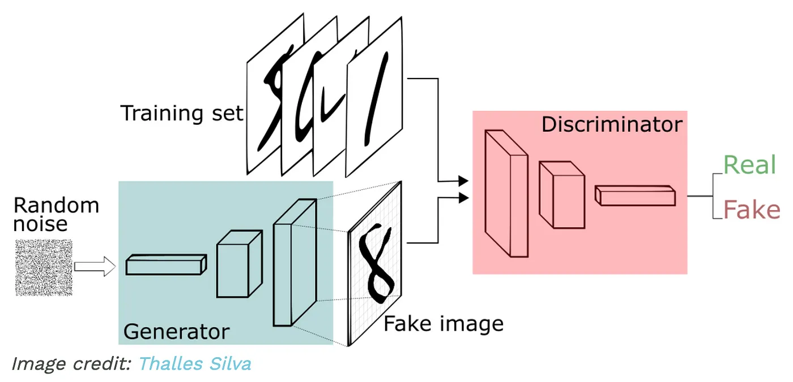
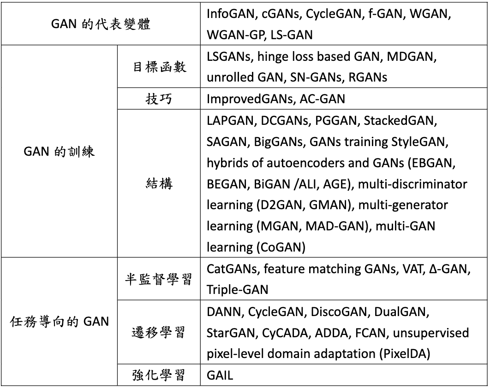
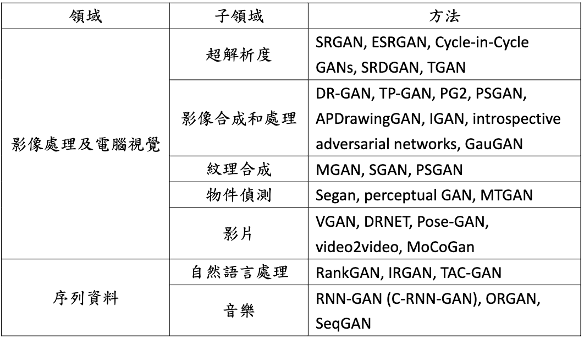

# [Day6] GAN，聽說你最強，參數很難調

Author: Nick Zhuang
Type: AI & Data

## 提要

- [前言](#前言)
- [GAN介紹](#gan介紹)
- [GAN演進](#gan演進)

## 前言

今天我們介紹什麼是GAN(Generative Adversarial Network，GAN)，先看什麼是GAN、及GAN的演進等等。

## GAN介紹

生成對抗網路（Generative Adversarial Network，GAN）是一種強大的生成模型，由生成器和判別器組成，透過對抗過程來訓練。

以下是有關生成對抗網路的簡要介紹：

1. **結構：** GAN 包含兩個主要組件：生成器（Generator）和判別器（Discriminator）。生成器負責生成與真實數據相似的樣本，而判別器則試圖區分真實數據和生成器生成的數據。
2. **對抗過程：** 訓練過程中，生成器和判別器進行對抗。生成器努力生成逼真的樣本以欺騙判別器，同時判別器努力識別出真實數據和生成的數據之間的區別。
3. **最小最大博弈：** GAN 的訓練過程可以理解為一種最小最大博弈。生成器的目標是最小化判別器對其生成的數據的機率估計，從而生成更逼真的樣本。判別器的目標是最大化對真實數據的識別能力以及對生成的數據的識別能力。
4. **生成過程：** 在訓練完成後，生成器可以使用隨機雜訊作為輸入，生成與真實數據相似的新樣本。這種生成過程使得 GAN 能夠創造具有高質量的樣本。
5. **應用範疇：** GAN 在圖像生成、風格轉換、影像超分辨率、音頻合成、文本生成等多個領域都取得了驚人的成就。它能夠生成逼真的樣本，同時在藝術創作、影視特效等方面也有潛在應用。
6. **變種：** GAN 的不同變種包括條件生成對抗網路（cGAN）、週期一致性生成對抗網路（CycleGAN）、生成對抗自編碼器（GAN-AE）等，這些變種擴展了 GAN 的應用範圍。

總之，生成對抗網路（GAN）是一種基於對抗訓練的生成模型，透過生成器和判別器的博弈來創造逼真的樣本。GAN 在生成任務中取得了重大突破，並且在多個領域中持續發展和應用。

## GAN演進

生成對抗網路（Generative Adversarial Network，GAN）在其提出以來經歷了多個階段的演進和改進。以下是GAN演進的簡要介紹：

1. **原始GAN：** GAN 最早由 Ian Goodfellow 等人於 2014 年提出。它由生成器和判別器組成，透過兩者的對抗過程來訓練生成逼真的數據。
2. **DCGAN：** 深度卷積生成對抗網路（Deep Convolutional GAN，DCGAN）是一種引入卷積神經網路結構的 GAN 變種，用於生成圖像。DCGAN 在圖像生成上取得了顯著進展。
3. **CGAN：** 條件生成對抗網路（Conditional GAN，cGAN）引入了條件信息，允許生成器在生成樣本時受到額外的條件限制，擴展了 GAN 的應用範圍。
4. **WGAN：** Wasserstein GAN（Wasserstein Generative Adversarial Network，WGAN）透過引入 W 距離的概念，解決了 GAN 訓練中的一些不穩定問題，使得訓練更加穩定。
5. **PGGAN：** 進步性增長生成對抗網路（Progressive Growing of GANs，PGGAN）透過逐步增加生成器和判別器的分辨率，使得生成的圖像更加細節豐富和逼真。
6. **CycleGAN：** 週期一致性生成對抗網路（CycleGAN）引入了週期一致性損失，用於圖像風格轉換。它能夠在不同的域之間進行圖像轉換，如將馬變成斑馬。
7. **BigGAN：** 大型生成對抗網路（BigGAN）透過增加模型的大小和訓練數據，實現了更高質量的圖像生成，同時引入了分類標籤的概念。
8. **StyleGAN：** 風格生成對抗網路（StyleGAN）透過將潛在向量的風格和內容分離，實現了更好的圖像生成和操控。StyleGAN2 進一步改進了模型的穩定性和生成效果。
9. **BERT-GAN：** 基於 GAN 的預訓練語言模型，例如 BERT-GAN，結合了生成模型和自然語言處理，用於文本生成和語言生成。
10. **繪畫GAN：** 運用 GAN 進行藝術和繪畫生成，如 DALL-E 和 Artbreeder，將 GAN 應用於創意和藝術領域。

總之，生成對抗網路（GAN）在各個方向上不斷演進和改進，從基本的結構到各種變種，從圖像生成到文本生成，都取得了重要的成就。這些改進不僅改善了生成品質，還擴展了 GAN 的應用範圍。

為了更好地表示其中不同種類的GAN之間的關係，茲整理列表如下：

可以看到從幾種不同面向GAN的分類；例如，代表變體、訓練、及任務導向。

在應用方面，GAN也有不同的種類，如下：

可以看到分為影像類的、還有文本類的，基本上就是二維資料和一維資料的差別，常見的面向上都有其應用。

## 小結

今天我們重新回顧了GAN，並介紹GAN的演進，明天我們會介紹PixelRNN的內容，明天見！

## 參考連結

- [GAN筆記](https://medium.com/hoskiss-stand/gan-note-791358c3b10b)
- [Generative Adversarial Networks](https://arxiv.org/abs/1406.2661)
- [A Review on Generative Adversarial Networks: Algorithms, Theory, and Applications](https://arxiv.org/pdf/2001.06937.pdf)
- [GAN介紹-李宏毅老師](https://www.youtube.com/watch?v=8zomhgKrsmQ&list=PLJV_el3uVTsPy9oCRY30oBPNLCo89yu49&index=27)
