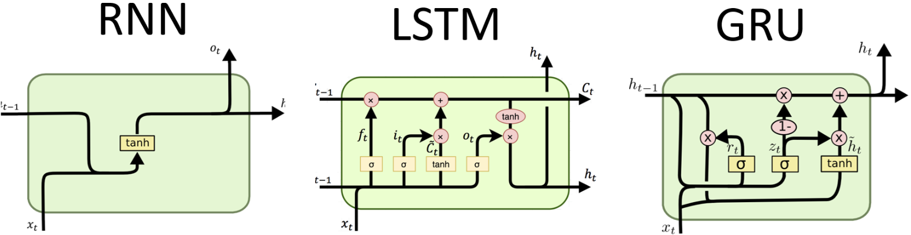
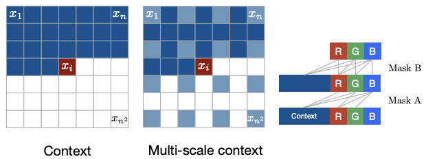
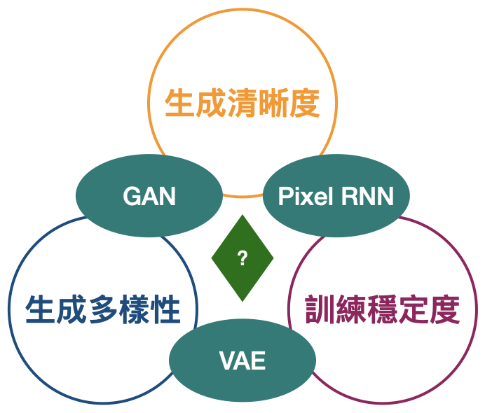

# [Day7] Pixel RNN，簡單，卻不失優雅

Author: Nick Zhuang
Type: AI & Data

## 提要

- [前言](#前言)
- [RNN介紹](#rnn介紹)
- [Pixel RNN介紹](#pixel-rnn介紹)
- [生成模型比較](#生成模型比較)

## 前言

今天我們會詳細介紹關於Pixel RNN的內容；例如，RNN介紹、Pixel RNN介紹、及生成模型比較。Pixel RNN 是一個基於深度RNN的模型，它可以在二維圖像上利用已知個單像素去生成相鄰的像素，進而以此規則生成新的圖像，不過按照這樣的邏輯來看，它只能以舊有的模式去生成圖像，它沒法以天馬行空的自由發想創意的方式去生成新的圖像，以下我們會詳細介紹它。

## RNN介紹

循環神經網路（ Recurrent Neural Network，RNN ）是一種在序列數據處理中廣泛使用的神經網路結構。以下是有關RNN的簡要介紹：

1. **序列數據處理：** RNN 主要用於處理序列性數據，例如語言、語音、時間序列等。它能夠捕捉數據中的時間相依性和順序信息。
2. **循環結構：** RNN 的特點是在網路中引入循環的連接，使得網路在處理每個時間步的輸入時，能夠考慮之前時間步的信息。這使得 RNN 具有記憶過去的能力。
3. **隱藏狀態：** RNN 中的隱藏狀態（Hidden State）在每個時間步都被更新，並且可以捕捉過去的輸入信息。這個隱藏狀態在後續時間步中影響著模型的輸出。
4. **梯度消失和梯度爆炸：** 傳統的 RNN 存在梯度消失和梯度爆炸的問題，導致在處理長序列時難以有效學習長距離的相依關係。為了解決這個問題，出現了一些改進的 RNN 變種，如長短時記憶網路（LSTM）和門控循環單元（GRU）。
5. **應用範疇：** RNN 在自然語言處理中被廣泛應用於語言模型、機器翻譯、語音識別等任務。同時，它也用於處理時間序列數據，如股票價格預測、天氣預報等。
6. **訓練和優化：** 訓練 RNN 模型需要考慮序列長度，通常使用反向傳播算法進行參數優化。然而，由於序列長度的變化，RNN 的訓練可能會變得複雜。

總之，循環神經網路（RNN）是一種專門用於處理序列數據的神經網路結構，透過引入循環結構和隱藏狀態，能夠捕捉時間相依性，但也存在著梯度消失和梯度爆炸等問題。

## Pixel RNN介紹

Pixel RNN 是一種用於生成圖像的神經網路模型，其目標是生成符合特定樣式的高質量圖像。以下是有關 Pixel RNN 的簡要介紹：

1. **像素級生成：** Pixel RNN 的主要任務是透過對每個像素進行生成，創建出逼真的圖像。與傳統的生成對抗網路（ GANs ）不同，Pixel RNN 是一種直接對像素進行建模的生成方法。
2. **循環結構：** 與一般的卷積神經網路（CNN）不同，Pixel RNN 使用了類似循環神經網路（ RNN ）的結構，以確保生成像素時能夠考慮到上一行和左邊的像素。這樣可以捕捉到圖像中的空間相依性。
3. **訓練策略：** Pixel RNN 使用了一種策略稱為「Teacher Forcing」，即在訓練過程中，將真實的先前像素作為輸入來預測下一個像素。這有助於模型學習到圖像的局部結構和特徵。
4. **多層結構：** 為了更好地捕捉圖像的複雜特徵，Pixel RNN 可以具有多層的結構。每一層都對應於圖像的不同分辨率，從而能夠同時捕捉細節和全局特徵。
5. **生成策略：** 在生成過程中，Pixel RNN 從左上角開始，逐步生成像素，每次生成一個像素後，將其作為下一步生成的輸入之一。這樣的生成策略確保了生成的圖像在結構和細節上都是一致的。

   
6. **應用範疇：** Pixel RNN 主要應用於生成逼真的圖像，尤其是在需要特定樣式或結構的場景中。它可以用於生成藝術作品、卡通圖像、風景照片等。

總之，Pixel RNN 是一種基於循環結構的神經網路模型，專門用於生成圖像。透過考慮空間相依性、多層結構和特殊的生成策略，Pixel RNN 能夠生成具有高質量和一致性的圖像內容。

## 生成模型比較

VAE、GAN、Pixel RNN的方法都有其優點和缺點；例如，VAE允許我們在具有潛在變量的複雜機率圖形模型中執行學習和高效的貝葉斯推理，但生成的樣本往往有點模糊。GAN 目前可以生成最清晰的圖像，但由於在訓練的動態上並不穩定，它們更難以優化。Pixel RNN 具有非常簡單且穩定的訓練過程（softmax 損失），並且目前提供最佳對數似然性（即生成數據的合理性）。然而，它們在採樣過程中效率相對較低，並且不容易為圖像提供簡單的低維代碼。我們可以持續關注它們後續的發展。

## 小結

今天我們回顧了 RNN 的演進，並介紹了關於 Pixel RNN 的內容，明天我們會介紹 Flow 相關的內容，明天見！

## 參考連結

- [Generative models](https://openai.com/research/generative-models)
- [Pixel Recurrent Neural Networks](http://arxiv.org/abs/1601.06759)
- [RNN、LSTM、GRU](http://dprogrammer.org/rnn-lstm-gru)
- [Pixel RNN介紹-李宏毅老師](https://www.youtube.com/watch?v=YNUek8ioAJk&list=PLJV_el3uVTsPy9oCRY30oBPNLCo89yu49&index=28)
- [Pixel RNN論文閱讀](https://blog.csdn.net/weixin_37993251/article/details/88726439)
