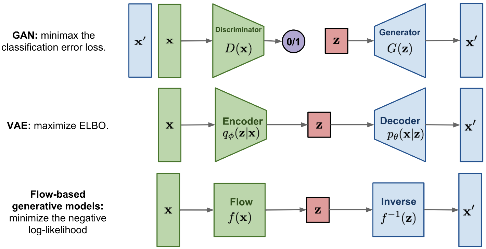

# [Day8] Flow，神秘的流派

Author: Nick Zhuang
Type: AI & Data

## 提要

- [前言](#前言)
- [Flow的架構](#Flow的架構)
- [Flow的種類](#Flow的種類)
- [Flow的應用](#Flow的應用)

## 前言

今天我們會介紹Flow的內容，包含：Flow的架構、Flow的種類、及Flow的應用。
~~P.S. 沒寫公式這篇超難講，難度超高啊啊啊~~

## Flow的架構

我們先回顧一下之前提過的內容；例如，VAE和GAN，同樣也是生成式模型的架構，三者在架構上有何差異，如下圖。

列表如下：

1. GAN： 生成是對抗網路，主要包含兩個主要組件：生成器（Generator）和判別器（Discriminator）。生成器負責生成與真實數據相似的樣本，而判別器則試圖區分真實數據和生成器生成的數據，訓練過程可以理解為一種最小最大博弈。生成器的目標是最小化判別器對其生成的數據的機率估計，從而生成更逼真的樣本。判別器的目標是最大化對真實數據的識別能力以及對生成的數據的識別能力。
2. VAE： 變分自動編碼器，主要組件組成：編碼器（Encoder）和解碼器（Decoder）。編碼器將輸入數據映射到均值和變異數參數，解碼器使用這些參數來生成新的樣本。訓練使用的是一種特殊的損失函數，即「重建損失」和「KL 散度 ( Kullback-Leibler divergence )」的組合，透過最大化證據下限  ( Evidence lower bound, ELBO )  來隱式優化數據的對數似然(log likelihood)。
3. 基於流的生成模型是通過一系列可逆變換構建的。與其他兩個不同的是，該模型會直接學習數據分佈 *P*(x) ，因此損失函數就是負對數似然 ( log likelihood )的函數。

## Flow的種類

有鑒於Flow架構的基本概念包含：Jacobian matrix、Determinant、及Change of Variable Theorem，簡單來說，在將流正規化 (Normalizing Flows) 的時候，透過這三個概念，就可以推導及簡化機率密度的函數，他這個作法是將一個個高斯分佈做疊加，達到模擬對數似然函數的目的，如下圖所示。

關於Flow的變體有很多種類，但不外乎是基於Jacobian matrix的性質；例如，Nonlinear Independent Components Estimation (NICE)、Real Non-Volume Preserving (Real NVP)、Generative Flow (Glow)，也有結合auto regressive的Masked autoregressive flow (MAF)等等。

## Flow的應用

原則上因為是生成模型，所以很適合作為建模任務使用；例如，語音生成、圖像生成、視頻合成，甚至是圖像壓縮及異常檢測都有其應用。

## 小結

今天我們回顧了Flow的架構，它是一個直接模擬數據分佈的模型，其性質可以很好的找到反函數，明天會介紹Diffusion的內容，明天見！

## 參考連結

- [基於流的生成模型](https://zhuanlan.zhihu.com/p/351479696)
- [Variational Inference with Normalizing Flows](https://arxiv.org/pdf/1505.05770.pdf)
- [Flow based Model-李宏毅老師](https://www.youtube.com/watch?v=uXY18nzdSsM&t=2983s)
- [Flow-based Deep Generative Models](https://lilianweng.github.io/posts/2018-10-13-flow-models/)
- [Flow-based generative model-wiki](https://en.wikipedia.org/wiki/Flow-based_generative_model)
