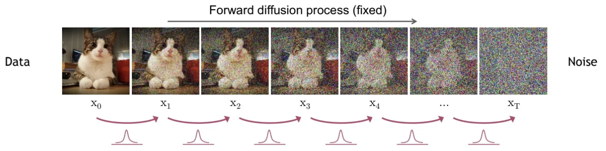
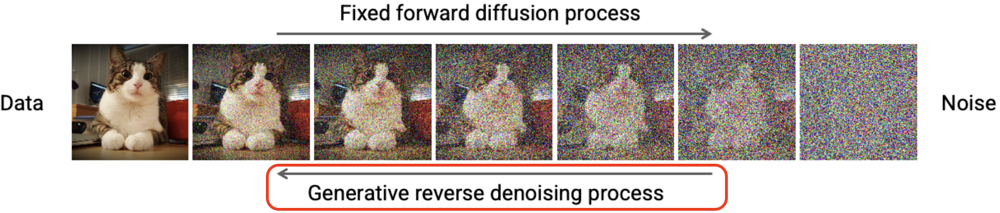
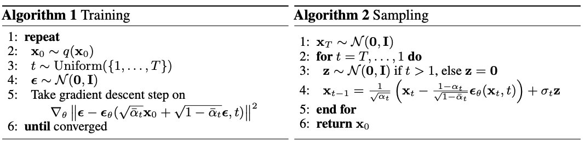
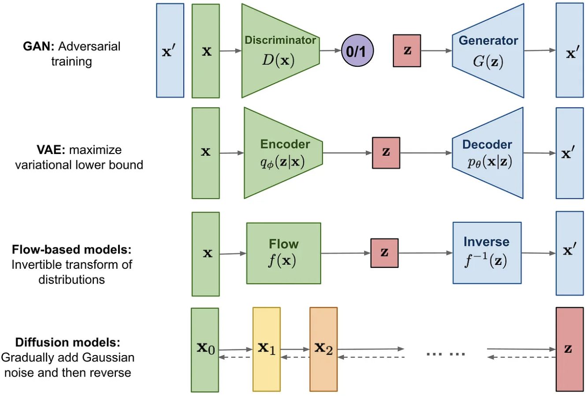
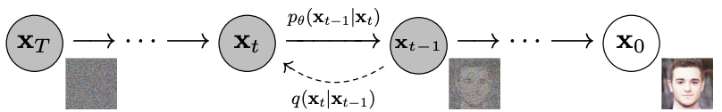

# [Day9] Diffusion，終於見到你

Author: Nick Zhuang
Type: AI & Data

## 提要

- [前言](#前言)
- [擴散](#擴散)
- [去噪](#去噪)
- [演算法](#演算法)
- [近期回顧](#近期回顧)
- [補充](#補充)

## 前言

今天我們會介紹擴散模型 (Denoising Diffusion Probabilistic Model，DDPM) 相關的內容，包含：擴散 (Diffusion)、去噪 (Denoise)、演算法、近期回顧、及補充。

## 擴散

擴散的過程是前向過程 (forward process)，它會將雜訊加入至原先的圖片當中，直到無法辨識原圖片為止，其中的雜訊是高斯分佈的，也就是常態分佈的雜訊，使用常態分佈的好處是容易理解，整體流程如下圖所示。

可以看到貓的圖片經過加入高斯雜訊的流程，圖像逐步添加了雜訊，直到看不清原圖為止，這個圖像就是隨機雜訊的圖像。

## 去躁

去躁的過程是反向過程 ( reverse process )，它會將隨機雜訊的圖像，逐步還原回原始的圖像，整體流程如下圖所示。

可以看到隨機雜訊的圖像，經過層層的去除雜訊處理處理後，會還原成原本的圖像，這就是去躁的學習過程。

## 演算法

這一小節我們深入探討一下其中的演算法，主要分為訓練、生成兩個部分。

具體來說，原理上在擴散的過程中，實際上是用到了去躁步驟的反向邏輯，那麼是如何做到這點的？我們可以回顧下以前在去躁的做法，一般來說就是使用去躁的自編碼器 (Denoise Auto-encoder, DAE)，在這邊除了原始作法的DAE外，還加上了Score Matching及Langevin dynamics的方法。
Score Matching是一種參數估計的方法，相較於傳統的蒙地卡羅方法 (Markov Chain Monte Carlo method, MCMC) 較為節省時間，原因是它可以透過複雜函數中的導數去做估計。
Langevin dynamics是來自於分子動力學的方法，在這邊主要是為了要找到要訓練的目標函數，這個目標函數不是一蹴可幾的，它只有紀錄倆倆狀態之間的關係，讓每一次的變化幅度都相同。
因此，訓練階段，主要是透過目標函數去訓練生成雜訊的模型，而在生成階段，主要是從高斯分佈的雜訊中，用模型生成的雜訊，逐步分離訊號，直到獲得我們所要的生成數據為止。

## 補充

- 去躁的其他方法
  上一小節提到的是利用原始數據與雜訊之間的差異，找到對應的目標函數做訓練，確認了差值的高斯分佈後，就能透過將隨機雜訊圖像扣除目標雜訊後，進而生成隨機的圖像，這是目前比較直觀主流的方式，但這裡有個問題，我們真的有辦法每次都能找到完全乾淨的圖像嗎？在企業的應用場景上，有時候因為拍攝或是其他因素，原始圖像就已經帶有雜訊，可以參考Noise2Noise論文當中的方法，可以實現無乾淨數據的去躁，在以真正乾淨的數據去訓練Diffusion Model。

## 近期回顧

在這我們簡單回顧一下介紹過的模型；例如，GAN、VAE、Flow-based models、Diffusion models，可以看到他們都是分為兩個組件的架構，而這兩個組件是互為逆反的。

## 小結

今天我們介紹了主軸中的Diffusion Model，其中的關鍵是，學習相鄰兩狀態的關係，找到其目標函數，計算出差異的雜訊，作為添加隨機的反向雜訊的依據，進而生成我們要的數據，後續，我們會接續討論其他的相關方法，明天見！

## 參考連結

- [DDPM: Denoising Diffusion Probabilistic Models](https://link.zhihu.com/?target=https%3A//arxiv.org/abs/2006.11239)
- [Diffusion Models](https://medium.com/image-processing-and-ml-note/diffusion-models-b4609ff05ae6)
- [擴散模型之DDPM](https://zhuanlan.zhihu.com/p/563661713)
- [另闢蹊徑—Denoising Diffusion Probabilistic 一種從噪音中剝離出圖像/音頻的模型](https://zhuanlan.zhihu.com/p/366004028)
- [【生成式AI】淺談圖像生成模型 Diffusion Model 原理](https://www.youtube.com/watch?v=azBugJzmz-o)
- [Noise2Noise-Learning Image Restoration without Clean Data](https://arxiv.org/abs/1803.04189)
- [圖像去噪論文Noise2Noise-Learning Image Restoration without Clean Data論文詳解](https://blog.csdn.net/weixin_36474809/article/details/86535639)
